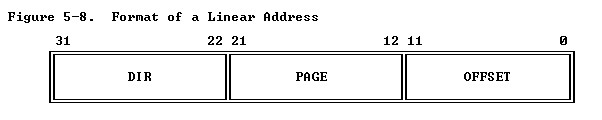
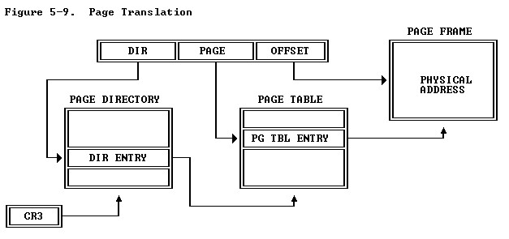
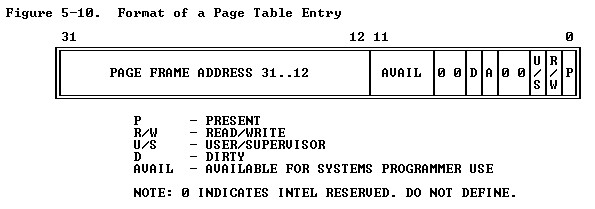
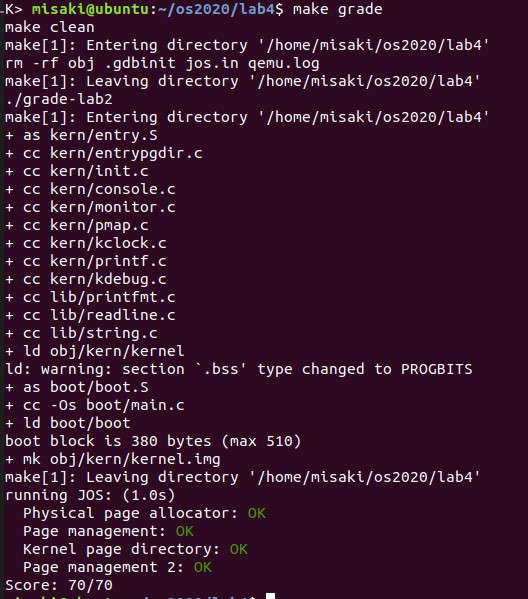
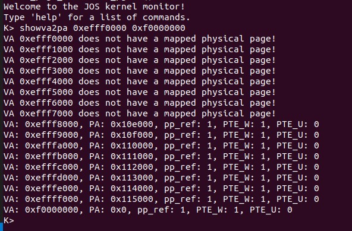
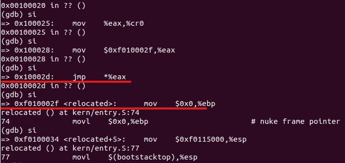
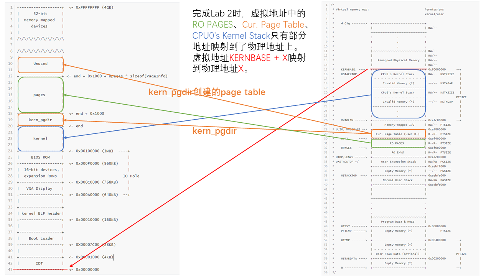
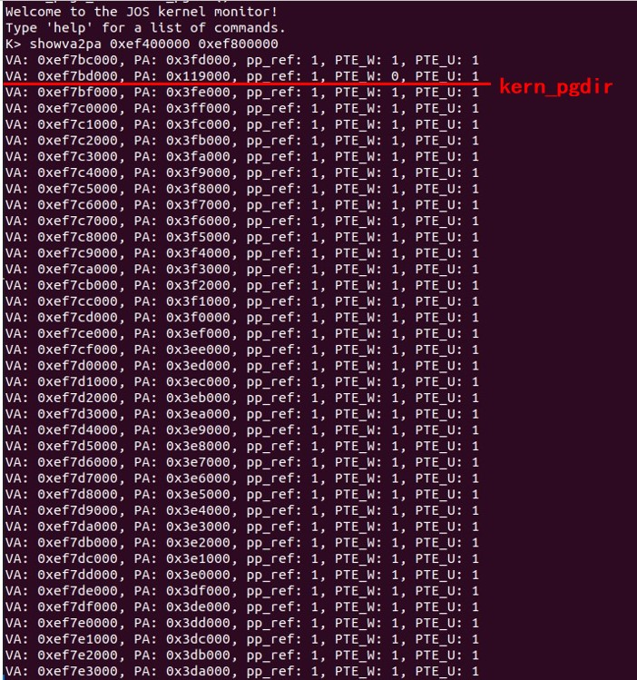

# Part 1: Physical Page Management

## Lab 1回顾

LAB 1中kernel被装载到物理地址`0x100000`，其映射的虚拟地址为`0xf0100000`，并且实现了虚拟地址`0xf0000000-0xf0400000`映射到物理地址`0x00000000-0x00400000`，虚拟地址`0x00000000-0x00400000`映射到物理地址`0x00000000-0x00400000`。映射的实现即地址简单的加减`KERNBASE`（`0xf0000000`），其中宏函数`KADDR`实现了以上物理地址到虚拟地址的转换，宏函数`PADDR`实现了以上了虚拟地址到物理地址的转换。映射的物理地址总共是4MB，访问超出以上范围的虚拟地址CPU都会报错。

## Lab 2相关说明

Part 1部分需要实现物理内存的初始化，暂时不需要实现物理地址到虚拟地址的映射，主要操作在`kern/pmap.c`的函数`mem_init()`中。

`mem_init()`首先调用`i386_detect_memory()`检测机器的内存大小，并设置`npages`和`npages_basemem`，两个变量都是以`PGSIZE`（4KB）为单位。

## Exercise 1

这里需要将所有的物理内存地址分成长度相同的`page`，每个`page`的大小都是4KB，所有可以分配的`page`都注册到一个链表中，链表节点的结构如下：

```c
struct PageInfo 
{
	struct PageInfo *pp_link;
	uint16_t pp_ref;
};
```

每个链表节点唯一对应一个`page`，并可以通过`page2pa()`得到`page`的起始物理地址，这样对`page`的全部操作实际上都是通过`PageInfo`结构来完成的。

查看`kern/pmap.h`发现还有其他关于`page`的地址转换函数

- `pa2page()`：通过物理地址得到指向该物理地址的`PageInfo`指针
- `page2kva()`：通过`PageInfo`指针得到`page`对应虚拟地址

内存管理组件维护一个链表`page_free_list`，这个链表将所有未分配的`page`连起来。需要分配内存时，将链表头部对应的`page`返回，并将链表头部更新为链表中的下一个元素。

### `boot_alloc()`

Exercise 1提到的函数中，有两个`page`分配器，其中`boot_alloc()`并不是真正的分配器，真正的分配器是`page_alloc()`，`page_alloc()`只是用于分配`page directory`的内存。由于`kernel`启动时需要将物理地址映射到虚拟地址，因此需要一个`page table`来记录这种映射关系，但是创建一个`page table`涉及到虚拟地址到物理地址的映射，此时JOS还没有实现上述功能，故解决办法是使用一个单独的`page allocator`，在一个固定的位置分配内存然后在这部分去做初始化的工作。

`boot_alloc()`中定义的`nextfree`指针指向下一个空闲虚拟地址的`page`，并且`nextfree`会在第一次调用`boot_alloc()`时初始化为`kernel`的`.bss`节末端，即`kernel`的结束地址，也就是第一个未使用的虚拟内存地址。

根据注释的要求，`boot_alloc()`的功能如下

- `n==0`时直接返回`nextfree`
- `n>0`时分配`n Bytes`的物理内存，以`PGSIZE`大小对齐，返回一个虚拟地址，且不初始化。
  - 此功能可以用`result`记录当前`nextfree`，然后使用`ROUNDUP`更新`nextfree`
- 内存不足时`panic()`报错
  - `i386_detect_memory()`已经设置了`npages`，`npages * PGSIZE`即所有内存，故虚拟地址内存最大为`KERNBASE + npages*PGSIZE`

#### 实现代码

```c
static void* boot_alloc(uint32_t n)
{
	static char *nextfree;
	char *result;

	if (!nextfree) {
		extern char end[];
		nextfree = ROUNDUP((char *) end, PGSIZE);
	}

	if(n==0)
		return nextfree;

	result = nextfree;
	nextfree = nextfree + ROUNDUP(n, PGSIZE);

	if(nextfree > (char*)(KERNBASE + npages*PGSIZE))
	{
		panic("boot_alloc: Out of memory\n");
		nextfree = result;
		return NULL;
	}

	return result;
}
```

### `mem_init() - 1`

完成`boot_alloc()`后，根据注释的要求需要分配`npages`个`PageInfo`大小的内存并初始化为0。

```c
void mem_init(void)
{
    //...
    
///////////////////////////////////////////////////////////////////
	// Allocate an array of npages 'struct PageInfo's and store it in 'pages'.
	pages = (struct PageInfo *)boot_alloc(npages * sizeof(struct 	PageInfo));
	memset(pages, 0, npages * sizeof(struct PageInfo));
    
    //...
}
```

### `page_init()`

之前使用`boot_alloc()`分配的`pages`只是简单的分配了所有地址，但其中有部分地址是不能被用户程序使用的，因此需要在`page_init()`中设置`page_free_list`，用于后续地址分配。初始化不可用的地址只需要将`PageInfo::pp_ref`设置为1，表示其已经有映射了，并将`PageInfo::pp_link`设置为`NULL`；其余可用的地址则首尾相连，接入`page_free_list`。

根据注释的要求

- `pages[0]`不可用
- `[PGSIZE, npages_basemem * PGSIZE)`可用
- 地址`[IOPHYSMEM, EXTPHYSMEM]`不可用
- 地址`[EXTPHYSMEM, ..]`中部分不可用

> 其实`npages_basemem * PGSIZE == IOPHYSMEM`(0xA0000)
>
> `IOPHYSMEM`(0x100000)为`kernel`的起始位置

前三个要求很容易实现，对于`[EXTPHYSMEM, ..]`中不可用的地址可以通过`boot_alloc(0)`找到，因为`EXTPHYSMEM`为内核的起始位置，`boot_alloc()`的`nextfree`指针始终指向第一个可用的虚拟地址，因此`[EXTPHYSMEM, PADDR(boot_alloc(0))]`都是不可用的，其余地址是可用的。

#### 实现代码

```c
void page_init(void)
{
	size_t i;
	pages[0].pp_ref = 1;
	pages[0].pp_link = NULL;

	for (i = 1; i < npages_basemem; i++) 
	{
		pages[i].pp_ref = 0;
		pages[i].pp_link = page_free_list; 
		page_free_list = &pages[i];
	}

	uint32_t npages_IOPHYSMEM = IOPHYSMEM/PGSIZE;
	uint32_t npages_EXTPHYSMEM = EXTPHYSMEM/PGSIZE;

	for (i=npages_IOPHYSMEM ; i <npages_EXTPHYSMEM ; i++)
	{
		pages[i].pp_ref = 1;
		pages[i].pp_link = NULL;
	}

	uint32_t npages_end = ((uint32_t)boot_alloc(0) - KERNBASE) / PGSIZE; 
	
	for (i = npages_EXTPHYSMEM; i<npages_end; i++)
	{
		pages[i].pp_ref = 1;
		pages[i].pp_link = NULL;
	}
	for (i = npages_end; i < npages; i++){
		pages[i].pp_ref = 0;
		pages[i].pp_link = page_free_list; 
		page_free_list = &pages[i];
	}
}
```

### `page_alloc()`

`page_init()`设置好`page_free_list`后，可以使用`page_alloc()`从`page_free_list`头部拿出一个`page`分配，根据注释的要求并不需要修改分配的`page`的`PageInfo`信息。若`alloc_flags & ALLOC_ZERO`，还需要将`page`初始化。这里可以通过`page2kva()`得到`page`的虚拟地址，然后用`memset()`初始化即可。

#### 实现代码

```c
struct PageInfo* page_alloc(int alloc_flags)
{
	if(page_free_list==NULL)
		return NULL;

	struct PageInfo* result = page_free_list;
	page_free_list = page_free_list->pp_link;
	result->pp_link = NULL;

	if(alloc_flags & ALLOC_ZERO)
		memset(page2kva(result), 0, PGSIZE);

	return result;
}
```

### `page_free()`

`page_free`把当前`page`归还到`page_free_list`中，需要检查当前`page`的`PageInfo::pp_ref`和`PageInfo::pp_link`值防止删除一个有映射的`page`或者重复删除`page`。

#### 实现代码

```c
void
page_free(struct PageInfo *pp)
{
	if(pp->pp_ref != 0 || pp->pp_link != NULL)
	{
		panic("page_free: Freeing a referenced page or page double free\n");
		return;
	}
	pp->pp_link = page_free_list;
	page_free_list = pp;
}
```

# Part 2: Virtual Memory

在[Part 1](#Part 1: Physical Page Management)中已经实现了物理内存的分配，在Part 2中将建立物理内存和虚拟内存的映射关系。

## JOS内存管理机制

x86系统建立了两次内存映射`Segment Translation`和`Page Translation`，`Segment Translation`将`logical address`（用户可见的地址，即`virtual address`）转换成`linear address`，`Page Translation`将`linear address`转换成`physical address`。

JOS系统中通过GDT表将所有`segment base address`设置为0，并限制地址不超过`0xffffffff`，因此`Segment Translation`不起作用，`linear address`和`virtual address`相同，因此只需要实现`Page Translation`即可。

### Page Translation

`linear address`的结构如下：



`Page Translation`的过程如下：



`linear address`分成三个字段

- 0-11位：`OFFSET`
- 12-21位：`PAGE`
- 22-31位：`DIR`

三个字段都是一种`index`，分别索引的是`Page Directory`, `Page Table`, `Page Frame`。

10位的`DIR`索引`Page Directory`得到`Dir Entry`，即`Page Table`的地址。

10位的`PAGE`索引`Page Table`得到`PG TBL Entry`，即`Page Frame`的地址。

12位的`OFFSET`索引`Page Frame`得到`Physical Address`，`Page Frame`即Part 1中分配的页。

`Page Directory`的地址由`cr3`寄存器给出。

在这种内存管理方式下，一个`Page Directory`总共可以索引$2^{10}*2^{10}*2^{12}=2^{32}$个物理地址。

### Page Directory & Page Table

`Page Directory`和`Page Table`的`Entry`结构相同，都是一个32位的`page specifier`，其结构如下



`Page Directory Entry`的高20位为`Page Table`的物理地址，`Page Table Entry`的高20位为`Page Frame`的物理地址。这里之所以用高20位就可以表示两个表的物理地址，以`Page Directory`为例，一个`Entry`大小为4B，`Page Directory Entry`的索引只有10位，共$2^{10}$个条目，故`Page Directory`大小为4KB，其物理地址的低12位为全0，因此只需要使用高20位就可以表示其地址，用低12位表示一些控制位，使用地址时只需要将低12位置0即可，部分控制位如下：

- `Present Bit`，为1表示`Entry`有效，为0表示无效
- `Read/Write Bit`，为1表示可读写，为0表示只读
- `User/Supervisor Bit`，为1表示用户级数据，为0表示内核级数据

## Exercise 4

JOS中为了区分物理地址指针和虚拟地址指针，用`uintptr_t`表示虚拟地址，`physaddr_t`表示物理地址，它们其实都是`uint32_t`，使用时需要转换成指针。

此外`mmu.h, memlayout.h, pmap.h`有完成Part 2所需的各种工具代码。

### `pgdir_walk()`

`pgdir_walk`函数接受一个`page directory`、一个虚拟地址`va`，一个控制参数`create`，要求得到虚拟地址在这个`page directory`下对应的`page table entry`，即两次映射。

如果`va`对应的`Page Table`不存在，且`create`为`1`，则调用`page_alloc()`创建一个`Page Table`。

`inc/mmu.h`中定义的宏函数`PDX()`接受一个虚拟地址得到`page directory index`，使用`page directory index`索引`pgdir`得到`page directory entry`，`page directory entry`即为`page table`的地址。

随后根据`page directory entry`和`create`的值决定返回值

- `page directory entry`为0表示`Page Table`不存在
  - 若`create==0`则出错，返回`NULL`
  - 若`create!=0`则创建一个`page table`并返回`va`索引得到的`page table entry`
- `page directory entry`不为0表示`Page Table`存在，则直接返回`page table entry`

对于直接返回`page table entry`的情况，使用`inc/mmu.h`中的宏函数`PTE_ADDR()`将`page directory entry`的低12位置为`0`得到`page table`的物理地址，然后使用`KADDR()`将其转换成虚拟地址得到`page table`，最后使用`PTX(va)`索引`page table`得到`page table entry`。

对于需要创建新`page table`的情况，由于一个`page table`大小为4KB，调用`page_alloc(1)`分配一个4KB的`page`作为`page table`，返回指向该`page`的`PageInfo`结构指针，并将`PageInfo::pp_ref`置为1表示该`page`已用。使用`page2pa()`得到分配好的`page`的物理地址，并将其存储到`page table entry`中。最后设置`page table entry`的`P R/W U/S`位。

#### 实现代码

```c
pte_t* pgdir_walk(pde_t *pgdir, const void *va, int create)
{
	uintptr_t pdx = PDX(va);
	pte_t *pde = &pgdir[pdx];

	if(*pde==0 && create==0)
		return NULL;
	
	if(*pde==0 && create!=0)
	{
		struct PageInfo* pp = page_alloc(1);
		if(pp==NULL)
			return NULL;
		pp->pp_ref++;
		*pde = page2pa(pp) | PTE_P | PTE_W | PTE_U;
	}
	return (pte_t*)KADDR(PTE_ADDR(*pde)) + PTX(va);
}
```

### `boot_map_region()`

`boot_map_region()`函数将虚拟地址`va`中的连续几个`page`映射到连续的物理地址`pa`上。注释中说明这是静态映射，不要增加每个`page`对应的`PageInfo`结构的引用计数`pp_ref`。利用写好的函数`pgdir_walk()`，传入按`PGSIZE`增加的`va`，同时`create`设置为1防止得到空表，得到`va`对应`page table entry`的地址，将按`PGSIZE`增加的`pa`存入`page table entry`，存入`pa`时需要用`PTE_ADDR()`将`pa`低12位置0，并设置标志位，以满足`page table entry`的结构。

#### 实现代码

```c
static void boot_map_region(pde_t *pgdir, uintptr_t va, size_t size, physaddr_t pa, int perm)
{
	uintptr_t va_next;
	physaddr_t pa_next;
	for(pa_next = pa; pa_next<pa+size; pa_next+=PGSIZE)
	{
		pte_t* pte = pgdir_walk(pgdir, (void *)(pa_next-pa+va), 1);
		if(pte == NULL)
		{
			panic("boot_map_region: Out of memory\n");
			return;
		}
		*pte = PTE_ADDR(pa_next) | perm | PTE_P;
	}
}
```

### `page_lookup()`

`page_lookup()`函数传入虚拟地址`va`，得到其物理页地址，即`PageInfo`结构指针。根据注释，若`pte_store!=0`则把得到的`PageInfo`指针存到`pte_store`处。利用写好的函数`pgdir_walk()`即可直接得到`va`对应的物理页地址。

#### 实现代码

```c
struct PageInfo* page_lookup(pde_t *pgdir, void *va, pte_t **pte_store)
{
	pte_t* pte = pgdir_walk(pgdir, va, 0);
	if(pte == NULL || *pte==0)
		return NULL;
	
	if(pte_store)
		*pte_store = pte;

	return pa2page(PTE_ADDR(*pte));
}
```

### `page_remove()`

`page_remove()`函数删除一个虚拟地址`va`到物理页地址的映射。利用写好的`page_lookup()`函数可得到`va`对应物理页的`PageInfo`结构指针，同时利用`page_lookup()`的`pte_store`参数拿到`page table entry`的地址。使用`page_decref()`将`PageInfo`结构指针对应物理页释放，并将`page table entry`设置为0，下次读取这个`entry`时，就会认为它不包含有效信息。最后由于移除了一个`page table entry`，需要使用`tlb_invalidate()`移除对应TLB表的表项。

#### 实现代码

```c
void page_remove(pde_t *pgdir, void *va)
{
	pte_t* pte;
	struct PageInfo* page_info = page_lookup(pgdir, va, &pte);
	if(page_info == NULL)
		return;
	
	page_decref(page_info);
	*pte = 0;
	tlb_invalidate(pgdir, va);
}
```

### `page_insert()`

`page_insert()`函数建立一个新的物理地址（由`page2pa(pp)`给出）到虚拟地址`va`的映射，和之前的`boot_map_region`不同，这个映射不是静态映射，是将来要使用的，必须增加引用计数。若`va`已经有映射了，则需要使用`page_remove()`移除映射，必要时需要创建`page table`。

因此首先使用`pgdir_walk()`得到`page table entry`，其参数`create`设置为1。如果`page table entry`已经是`pp`给出的物理地址，则只需要设置`page table entry`的标志位，不需要增加引用；否则需要先删除原有映射，再往`page table entry`中存入`pp`给出的物理地址并设置标志位。

#### 实现代码

```c
int page_insert(pde_t *pgdir, struct PageInfo *pp, void *va, int perm)
{
	pte_t *pte = pgdir_walk(pgdir, va, 1);
	if (pte == NULL)
		return -E_NO_MEM;
	
	if(PTE_ADDR(*pte) == page2pa(pp))
	{
		*pte = PTE_ADDR(*pte) | perm | PTE_P;
		return 0;
	}

	page_remove(pgdir, va);
	pp->pp_ref++;
	*pte = page2pa(pp) | perm | PTE_P;
	return 0;
}
```

# Part 3: Kernel Address Space

`mem_init()`函数最开始使用`boot_alloc()`简单分配了`Page Directory`即`kern_pgdir`的内存。

在[Exercise 4](#Exercise 4)中实现了从`Page Directory`映射到`Page Frame`的函数，但是还并没有真正使用到它们，即`Page Directory`还没有初始化。Part 3中需要完成对`kern_pgdir`的初始化，建立真正的`Page Directory`，并将寄存器`cr3`设置为它的地址，最终得到的虚拟地址布局为`inc/memlayout.h`中的注释所示。

## Exercise 5

[Exercise  4](#Exercise 4)中实现的一系列函数中，使用`boot_map_region()`即可完成连续的地址映射。

### `mem_init() - 2`

结合`check_kern_pgdir()`和注释，首先需要建立`pages`数组的映射，从虚拟地址`UPAGES`映射到物理地址`PADDR(pages)`，大小为`npages`个`page`，`entry`的标志位设置为用户级只读，即`PTE_U | PTE_P`。

然后建立`kernel`栈的映射，从虚拟地址`KSTACKTOP - KSTKSIZE`映射到物理地址`PADDR(bootstack)`，大小为`KSTKSIZE`，`entry`的标志位设置为内核级可读写，即`PTE_W | PTE_P`。

之后建立`KERNBASE`之上虚拟地址的映射，从虚拟地址`KERNBASE`映射到物理地址`0`，大小为剩余所有虚拟地址即$2^{32}$-`KERNBASE`，`entry`的标志位设置为内核级可读写，即`PTE_W | PTE_P`。

最后由于`boot_map_region()`内部默认赋予`PTE_P`权限，因此在使用时不需要在参数中加`PTE_P`。

#### 实现代码

```c
void mem_init(void)
{
    //...
    
	//////////////////////////////////////////////////////////////////////
	// Now we set up virtual memory
    
	boot_map_region(kern_pgdir,
                    UPAGES,
                    ROUNDUP((sizeof(struct PageInfo) * npages), PGSIZE),
                    PADDR(pages),
                    PTE_U);
    
	boot_map_region(kern_pgdir,
                KSTACKTOP - KSTKSIZE,
                KSTKSIZE,
                PADDR(bootstack),
                PTE_W);
    
    boot_map_region(kern_pgdir,
                KERNBASE,
                0x100000000 - KERNBASE,
                0,
                PTE_W);
    
    //...
}
```

# `make grade`运行结果



# 展示地址映射的命令`showva2pa`

**在 `monitor.c` 中添加一个展示地址映射的命令 `showva2pa`（添加方式可 以参考 lab1的文档），该命令可以展示当前一些虚拟地址对应的物理页面信息 （或缺少物理映射）。例如，在 `kernel monitor` 中输入 `showva2pa 0xf0000000` 则输出 `0xf0000000` 、 `0xf0001000` 、 `0xf0002000` 对应的物理映射页信息（包括对应的物理地址，权限位， `pp_ref` 等）。 要求支持单页查询与范围查询 **

参考Lab 1中`backtrace()`函数的实现，首先需要在`kern/monitor.h`中定义`showva2pa()`函数，然后在`kern/monitor.c`中添加`showva2pa`指令。

`showva2pa()`的功能只需要使用Exercise 4中编写的[`page_lookup()`](#page_lookup())函数实现，因此需要将`kern/pmap.h`添加到`kern/monitor.c`的头文件中，为了防止头文件重复引用需要将`memlayout.h`和`assert.h`注释掉。使用`page_lookup()`可得到`va`对应`pa`的`PageInfo`结构指针，利用`page_lookup()`的`pte_store`参数拿到`page talbe entry`。`pa`由`page2pa()`得到，`PTE_W`和`PTE_U`分别是`page table entry`的第1和第2位（从0开始计数）。

最后传入参数由于是字符串，需要使用`lib/string.c`中的`strtol()`函数将其转换成整数。

#### 实现代码

> 假定传入参数地址都是16进制

```c
int
mon_showva2pa(int argc, char **argv, struct Trapframe *tf)
{
	if(argc == 1 || argc > 3)
	{
		cprintf("Arguments fault!\n");
		return 0;
	}

	uintptr_t va_start, va_end;
	pte_t* pte;
	struct PageInfo* pp;

	va_start = va_end = strtol(argv[1], NULL, 16);
	if(argc == 3)
		va_end = strtol(argv[2], NULL, 16);

	for(; va_start<=va_end; va_start+=PGSIZE)
	{
		pp = page_lookup(kern_pgdir, (void*)va_start, &pte);
		if(pp == NULL)
		{
			cprintf("VA 0x%x does not have a mapped physical page!\n", va_start);
			continue;
		}
		cprintf("VA: 0x%#x, PA: 0x%#x, pp_ref: %d, PTE_W: %d, PTE_U: %d\n", va_start, page2pa(pp), pp->pp_ref, ((*pte) & 0x2) >> 1, ((*pte) & 0x4) >> 2);
	}
	return 0;
}
```

#### 输出结果



# 问题回答

## Q1

**程序中的地址从什么时候开始都是虚拟地址了，请找到那几行代码**

在`kern/entry.S`中的以下代码段，从`jmp *eax`后都是虚拟地址

```assembly
	# Load the physical address of entry_pgdir into cr3.  entry_pgdir
	# is defined in entrypgdir.c.
	movl	$(RELOC(entry_pgdir)), %eax
	movl	%eax, %cr3
	# Turn on paging.
	movl	%cr0, %eax
	orl	$(CR0_PE|CR0_PG|CR0_WP), %eax
	movl	%eax, %cr0

	# Now paging is enabled, but we're still running at a low EIP
	# (why is this okay?).  Jump up above KERNBASE before entering
	# C code.
	mov	$relocated, %eax
	jmp	*%eax
```



这段代码的含义是把`entry_pgdir`的地址装载进`cr3`，并设置`cr0`的值开启`page translation`，随后通过`jmp *%eax`跳转到高地址，此时由于开启了`page translation`，故进入了虚拟地址中。

## Q2

**`mem_init()` 函数中 `kern_pgdir` 的虚拟地址是多少？物理地址呢？在我们还未完成本次 lab 之前，为什么我们已经可以使用虚拟地址了？**

- `kern_pgdir`的虚拟地址为`0xf0118000`，物理地址为`0x118000`。这个地址由`boot_alloc()`第一次调用时由`end`给出，为`kernel`的结束地址。

- 因为在`kern/entry.S`中事先建立了一个大小为4MB的虚拟地址到物理地址的映射，即虚拟地址`[KERNBASE, KERNBASE+4MB)`到物理地址`[0, 4MB)`。这个地址映射的`page directory`和`page tabe`在`kern/entrypgdir.c`中完成初始化，分别为`entry_pgdir`和`entry_pgtable`。在`mem_init()`中的`lcr3(PADDR(kern_pgdir));`未执行前，`cr3`寄存器的值为`entry_pgdir`的地址，因此是在使用这4MB的内存。

## Q3

**哪一行代码使得本次 lab 所构建的虚拟内存系统真正被使用？请指出它的位置。**

由`kern/pmap.c`中`mem_init()`函数中的`lcr3(PADDR(kern_pgdir));`实现。

`cr3`寄存器是`Page directory base`，`lcr3()`的功能即设置`cr3`寄存器的值。在此行语句之前`cr3`寄存器的值为`entry_pgdir`的地址（`entry_pgdir`参见[Q2](#Q2)），执行此行后`mem_init()`中建立的`page directory`即`kern_pgdir`开始起作用。

## Q4

**此操作系统可支持的最大物理内存是多少？为什么？**

最大物理内存为256MB。`KERNBASE`为所有物理内存映射的起始位置，因此物理内存映射的虚拟内存为`0xf0000000 - 0xffffffff`共256MB。

## Q5

**请详细描述在 JOS 中虚拟地址到物理地址的转换过程**

参见本文档的[JOS内存管理机制](#JOS内存管理机制)部分

## Q6

**在函数 pgdir_walk() 的上下文中，请说明以下地址的含义，并指出他们是虚拟地址还是物理地址：**

1. **pgdir**

2. **pgtab, 其中 pgtab = PTE_ADDR(pgdir[PDX(va)])**

3. **pg , 其中 p g = PTE_ADDR(KADDR(pgtab)[PTX(va)])**

- `pgdir`：`page directory`的虚拟地址
- `pgtab`：`page table`的物理地址
  - `PDX[va]`得到`va`中的`DIR`字段即`page directory`的索引，`pgdir[PDX(va)]`为`page directory entry`的值即`page table`的物理地址和控制位，最后`PTE_ADDR()`得到物理地址
- `pg`：`page frame`的物理地址
  - `KADDR(pgtab)`得到`page table`的虚拟地址，`PTX(va)`得到`va`中的`PAGE`字段即`page table`的索引，`KADDR(pgtab)[PTX(va)]`为`page frame`的虚拟地址，最后`PTE_ADDR()`得到物理地址

## Q7

**画出本次 Lab 结束后虚拟地址空间与物理地址空间的映射 关系，地址空间表示图中应至少包含 `kern_pgdir` 与 `pages` ，展示越多的细节越好。**



[Exercise 5](#Exercise 5)中三个`boot_map_region()`函数分别实现了以下三个映射

- [0xef000000, 0xef040000) --> [end + 0x1000, end + 0x41000 )即`pages`的映射
- [0xefff8000, 0xf0000000) --> [PADDR(bootstack), PADDR(bootstack) + 0x8000)即`kernel`栈的映射
- [0xf0000000, ...) --> [0, ...)

此外，`kern_pgdir`的虚拟地址在`0xef400000 - 0xef800000`中的某处，在没有执行`boot_map_region()`时就已经建立好了一个`page directory entry`，为`kern_pgdir`自身到物理地址的映射，除此之外`kern_pgdir`全部为空，这是由`mem_init()`中的以下代码实现的：

```c
kern_pgdir[PDX(UVPT)] = PADDR(kern_pgdir) | PTE_U | PTE_P;
```

在`mem_init()`中执行`boot_map_region()`时，由于`kern_pgdir`中只有一个表项，因此会不断在虚拟地址`0xef400000 - 0xef800000`上建立新的`page table`，此时会调用`page_alloc()`分配`page_free_list`中的内存并建立映射。

实际运行下`0xef400000 - 0xef800000`的映射结果如下

