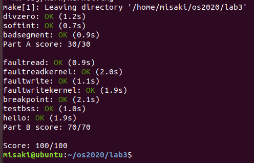
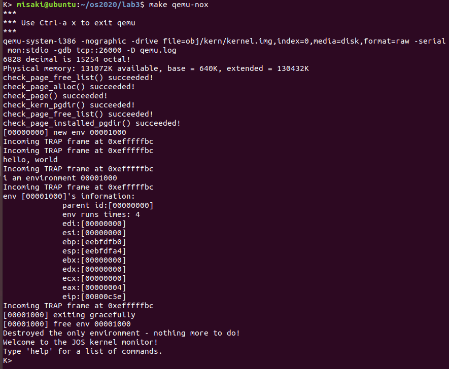

# Part A: User Environments and Exception Handling

在JOS中的环境其实就是进程，JOS使用Env数据结构描述一个环境

```c
// inc/env.h
struct Env {
	struct Trapframe env_tf;	// Saved registers
	struct Env *env_link;		// Next free Env
	envid_t env_id;			// Unique environment identifier
	envid_t env_parent_id;		// env_id of this env's parent
	enum EnvType env_type;		// Indicates special system environments
	unsigned env_status;		// Status of the environment
	uint32_t env_runs;		// Number of times environment has run

	// Address space
	pde_t *env_pgdir;		// Kernel virtual address of page dir
};
```

在`kern/env.c`中定义了三个全局`Env`指针，在之后的其他函数中会大量使用

```c
struct Env *envs = NULL;		// All environments
struct Env *curenv = NULL;		// The current env
static struct Env *env_free_list;	// Free environment list
					// (linked by Env->env_link)
```

## Exercise 1

Exercise 1的代码已经给出

```c
// kern/pmap.c
void
mem_init()
{
    // ...
    
    // Make 'envs' point to an array of size 'NENV' of 'struct Env'.
	// LAB 3: Your code here.
	uint32_t envs_length = NENV * sizeof(struct Env);
	envs = (struct Env *) boot_alloc(envs_length);
	memset(envs, 0, envs_length);
    
    // ...
    
    // Map the 'envs' array read-only by the user at linear address UENVS
	// (ie. perm = PTE_U | PTE_P).
	// Permissions:
	//    - the new image at UENVS  -- kernel R, user R
	//    - envs itself -- kernel RW, user NONE
	// LAB 3: Your code here.
	// pages to map;
	N = ROUNDUP(envs_length, PGSIZE); 
	// map the page dir;
	boot_map_region(kern_pgdir, UENVS, N, PADDR(envs), PTE_U);
    
    // ...
}
```

前半部分是调用LAB 2的`boot_alloc()`函数为`envs`数组分配内存并初始化

后半部分是调用LAB 2的`boot_map_region()`函数建立线性地址空间到物理地址空间的映射

x86的内存管理机制中有两次内存映射：`Segment Translation`和`Page Translation`，`Segment Translation`将虚拟地址转化为线性地址，`Page Translation`将线性地址转化为物理地址，也就是真正用来索引内存的地址。但在LAB 2中已经说明，JOS的`Segment Translation`没有映射虚拟地址，线性地址和虚拟地址相同。

## Exercise 2

根据给出的JOS系统运行流程，先运行`kern/entry.S`后，再运行`kern/init.c`的`i386_init()`函数

```c
void i386_init(void)
{
	extern char edata[], end[];
	memset(edata, 0, end - edata);
	cons_init();
	cprintf("6828 decimal is %o octal!\n", 6828);
	mem_init();
	// Lab 3 user environment initialization functions
	env_init();
	trap_init();

#if defined(TEST)
	ENV_CREATE(TEST, ENV_TYPE_USER);
#else
	ENV_CREATE(user_hello, ENV_TYPE_USER);
#endif 

	env_run(&envs[0]);
}
```

`i386_init()`函数执行了`env_init()`和`trap_init()`初始化后，会进入`#else`的`ENV_CREATE`，其调用`env_create(_binary_obj_user_hello_start, ENV_TYPE_USER)`直接把用户二进制程序嵌入到内核中。`_binary_obj_user_hello_start`定义在`obj/kern/kernel.sym`中，表示用户程序的起始线性地址。

根据讲义，`env_create()`需要调用`env_alloc()`和`load_icode()`将嵌入内核的二进制文件加载到内存。

- `env_alloc()`分配和初始化新环境，其调用`env_setup_vm()`为新环境分配页目录

- `load_icode()`将二进制文件加载到用户地址空间，其调用`regin_alloc()`建立虚拟地址到物理地址的映射

`env_run()`以用户模式运行给定的环境

以上即`i386_init()`相关函数的运行流程

### `env_init()`

根据注释可知需要把`envs`数组全部初始化为0，然后使用`Env::env_link`按顺序连接每个环境，并将最后一个`Env::env_link`设置为`NULL`。由于当前环境全部为空，因此`env_free_list`应指向`envs`的头部`envs[0]`

#### 实现代码

```c
void env_init(void)
{
	memset(envs, 0, sizeof(struct Env)*NENV);
	env_free_list = &envs[0];
	int i;
	for(i=0; i<NENV-1; i++)
	{
		envs[i].env_link = &envs[i+1];
	}
	envs[NENV-1].env_link = NULL;
	env_init_percpu();
}
```

### 给出的`env_setup_vm()`

主要功能是使用LAB 2中的函数，为当前的环境`e`指向的`Env`结构分配一个页，用来存放页表目录，然后完成虚拟地址到物理地址的映射

其返回值为负表示分配失败

### 给出的`region_alloc()`

主要功能是根据给定的页表目录`e`，申请长度为`len`的物理内存，并将其映射到虚拟地址`va`上去

### 给出的`load_icode()`

主要功能是将直接链接进内核的可执行二进制文件取出来执行

其先解析ELF文件的文件头和各段的程序头，然后根据程序头文件中的信息，将内核中的ELF文件信息复制到用户空间的虚拟地址处

调用`region_alloc()`申请执行ELF文件需要的物理地址空间，并将其映射到用户虚拟地址空间上

### `env_create()`

`env_create()`的参数`binary`就是需要运行的文件名，根据上述`load_icode()`的理解，`binary`参数需要传递给`load_icode()`；参数`type`即注释中需要给新环境设置的`env_type`，因此分三步实现

1. 调用`env_alloc()`分配环境，`env_alloc()`的参数`parent ID`设置为0
2. 设置环境的`env_type`
3. 调用`load_icode()`加载文件内容到当前环境

需要注意的是，`env_alloc()`的返回值代表分配是否成功，需要判断才能进行后续操作

#### 实现代码

```c
void env_create(uint8_t *binary, enum EnvType type)
{
	struct Env *e = NULL;
	int ret = env_alloc(&e, 0);
	if(ret != 0)
		panic("env create failed!");
	else
	{
		e->env_type = type;
		load_icode(e, binary);
	}
}	
```

### `env_run()`

主要功能是从当前环境`curenv`切换到环境`e`运行，注释中给出了详细步骤

1. 如果是上下文切换
   1. 如果当前环境状态为`ENV_RUNNING`则将其设置为`ENV_RUNNABLE`
   2. 将`curenv`指向新环境
   3. 将`curenv`的状态设置为`ENV_RUNNING`
   4. 更新`curenv`的`env_runs`计数器
   5. 使用`lcr3()`切换到`curenv`的地址空间
2. 使用`env_pop_tf()`保存`curenv`的寄存器并切换到用户模式

#### 实现代码

```c
void env_run(struct Env *e)
{
	if(curenv != NULL && curenv->env_status == ENV_RUNNING)
		curenv->env_status = ENV_RUNNABLE;
	curenv = e;
	curenv->env_status = ENV_RUNNING;
	curenv->env_runs++;
	lcr3(PADDR(curenv->env_pgdir));
	env_pop_tf(&curenv->env_tf);
}
```

> 最开始没有考虑`curenv == NULL`的情况，导致`make grade`出错，应该出现了无法运行`env_run(&envs[0])`的情况

## Exercise 4

JOS系统使用两种机制进行中断保护

1. 中断描述表（Interrupt Descriptor Table, IDT）
   - IDT指定了一系列中断处理函数作为中断的入口，中断发生时处理器跳转到指定函数开始执行中断处理。x86最多允许256个不同的中断或异常入口进入内核，每个中断入口都具有不同的中断向量。向量是介于0到255之间的数字。CPU使用该向量作为IDT的索引
2. 任务状态段（Task State Segment, TSS）
   - 中断发生后，处理器将之前的执行状态保存在Task State指定好的栈中，以便之后能够返回到指定状态继续执行。中断触发后，处理器把当前栈顶切换到这个栈，并压入相应信息。这些操作必须在内核态下完成

讲义中说明这一节只处理0-31的中断向量产生对应的异常，需要实现的代码在`kern/trap.c/trap_init()`和`kern/trapentry.S`中。

在`trap_init()`函数中，借助宏`SETGATE`配置中断描述符表，指定中断的入口函数。`SETGATE`定义在`inc/mmu.h`中：`SETGATE(gate, istrap, sel, off, dpl)`，`gate`即IDT的条目序号，`istrap`用1代表异常、0代表中断，`sel`为中断处理函数选择器，`off`指定中断处理函数在`code segmet`的偏移，`dpl`指定权限，0代表内核级、3代表用户级

### `trapentry.S`

`trapentry.S`中提供了两个宏`TRAPHANDLER`和`TRAPHANDLER_NOEC`用于定义中断处理函数，其参数`name`代表定义的函数名，`num`代表中断向量，其定义在`inc/trap.h`中。两个函数分别用于CPU自动压栈和不自动压栈`error code`的中断，查看[x86所有异常](https://pdos.csail.mit.edu/6.828/2018/readings/i386/s09_10.htm)知每个中断分别应该使用哪个宏定义，需要定义的中断在`kern/trap.c/trapname()`中

宏`TRAPHANDLER`和`TRAPHANDLER_NOEC`最后都转到`_alltraps()`函数，`_alltraps()`的功能如下	

1. 让更多信息进栈，使得栈具有结构体`struct TrapFrame`的形式
2. 在寄存器`%ds, %es`的位置上放置宏`GD_KD`的值
3. 将当前栈指针压栈，给`trap`函数传递参数
4. 调用`trap`函数

`struct Trapframe`结构如下

```c
struct Trapframe {
	struct PushRegs tf_regs;
	uint16_t tf_es;
	uint16_t tf_padding1;
	uint16_t tf_ds;
	uint16_t tf_padding2;
	uint32_t tf_trapno;
	/* below here defined by x86 hardware */
	uint32_t tf_err;
	uintptr_t tf_eip;
	uint16_t tf_cs;
	uint16_t tf_padding3;
	uint32_t tf_eflags;
	/* below here only when crossing rings, such as from user to kernel */
	uintptr_t tf_esp;
	uint16_t tf_ss;
	uint16_t tf_padding4;
} __attribute__((packed));
```

`struct PushRegs`结构如下

```c
struct PushRegs {
	/* registers as pushed by pusha */
	uint32_t reg_edi;
	uint32_t reg_esi;
	uint32_t reg_ebp;
	uint32_t reg_oesp;		/* Useless */
	uint32_t reg_ebx;
	uint32_t reg_edx;
	uint32_t reg_ecx;
	uint32_t reg_eax;
} __attribute__((packed));
```

`tf_trapno`已经在宏`TRAPHANDLER`和`TRAPHANDLER_NOEC`中压栈：`push $(num)`，因此接下来只需要把`tf_ds`、`tf_es`、`tf_regs`按顺序压栈（`padding`只是占位符）；然后把`GD_KD`的值赋值给`%ds`和`%es`；最后把`%esp`压栈调用`trap`

#### 实现代码

```asm
TRAPHANDLER_NOEC(t_divide, T_DIVIDE)
TRAPHANDLER_NOEC(t_debug, T_DEBUG)
TRAPHANDLER_NOEC(t_nmi, T_NMI)
TRAPHANDLER_NOEC(t_brkpt, T_BRKPT)
TRAPHANDLER_NOEC(t_oflow, T_OFLOW)
TRAPHANDLER_NOEC(t_bound, T_BOUND)
TRAPHANDLER_NOEC(t_illop, T_ILLOP)
TRAPHANDLER_NOEC(t_device, T_DEVICE)

TRAPHANDLER(t_dblflt, T_DBLFLT)
// TRAPHANDLER_NOEC(t_coproc, T_COPROC)
TRAPHANDLER(t_tss, T_TSS)
TRAPHANDLER(t_segnp, T_SEGNP)
TRAPHANDLER(t_stack, T_STACK)
TRAPHANDLER(t_gpflt, T_GPFLT)
TRAPHANDLER(t_pgflt, T_PGFLT)

TRAPHANDLER(t_fperr, T_FPERR)
TRAPHANDLER(t_align, T_ALIGN)
TRAPHANDLER(t_mchk, T_MCHK)
TRAPHANDLER(t_simderr, T_SIMDERR)

TRAPHANDLER_NOEC(t_syscall, T_SYSCALL)


_alltraps:
	pushl %ds
	pushl %es
	pushal
	movw $GD_KD, %ax
	movw %ax, %ds
	movw %ax, %es
	pushl %esp
	call trap
```

### `trap.c/trap_init()`

`trap.c`中需要实现`trap_init()`函数，使用`SETGATE(gate, istrap, sel, off, dpl)`初始化IDT，IDT表项的中断处理函数已经在`trapentry.S`中定义，只需要先声明再传入`SETGATE`宏即可，`SETGATE()`的参数`gate`即中断类型对应的idt表项序号，使用`inc/trap.h`中定义的中断类型作为索引；由于处理的都是中断，故`istrap`为0；`sel`为`code segment selector`，应为`GD_KT`；`off`即`code segment`的处理函数地址偏移，直接填入`trapentry.S`中定义的函数名（即函数地址）即可；`dpl`一般设置为内核级，但某些中断需要设置为用户级，如`T_BRKPT`、`T_DEBUG`、`T_SYSCALL`，允许用户调用

#### 实现代码

```c
void trap_init(void)
{
	extern struct Segdesc gdt[];
    
	void t_divide();
	SETGATE(idt[T_DIVIDE], 0, GD_KT, t_divide, 0)
	void t_debug();
	SETGATE(idt[T_DEBUG], 0, GD_KT, t_debug, 3)
	void t_nmi();
	SETGATE(idt[T_NMI], 0, GD_KT, t_nmi, 0)
	void t_brkpt();
	SETGATE(idt[T_BRKPT], 0, GD_KT, t_brkpt, 3)
	void t_oflow();
	SETGATE(idt[T_OFLOW], 0, GD_KT, t_oflow, 0)
	void t_bound();
	SETGATE(idt[T_BOUND], 0, GD_KT, t_bound, 0)
	void t_illop();
	SETGATE(idt[T_ILLOP], 0, GD_KT, t_illop, 0)
	void t_device();
	SETGATE(idt[T_DEVICE], 0, GD_KT, t_device, 0)
	void t_dblflt();
	SETGATE(idt[T_DBLFLT], 0, GD_KT, t_dblflt, 0)
	void t_tss();
	SETGATE(idt[T_TSS], 0, GD_KT, t_tss, 0)
	void t_segnp();
	SETGATE(idt[T_SEGNP], 0, GD_KT, t_segnp, 0)
	void t_stack();
	SETGATE(idt[T_STACK], 0, GD_KT, t_stack, 0)
	void t_gpflt();
	SETGATE(idt[T_GPFLT], 0, GD_KT, t_gpflt, 0)
	void t_pgflt();
	SETGATE(idt[T_PGFLT], 0, GD_KT, t_pgflt, 0)
	void t_fperr();
	SETGATE(idt[T_FPERR], 0, GD_KT, t_fperr, 0)
	void t_align();
	SETGATE(idt[T_ALIGN], 0, GD_KT, t_align, 0)
	void t_mchk();
	SETGATE(idt[T_MCHK], 0, GD_KT, t_mchk, 0)
	void t_simderr();
	SETGATE(idt[T_SIMDERR], 0, GD_KT, t_simderr, 0)
	void t_syscall();
	SETGATE(idt[T_SYSCALL], 0, GD_KT, t_syscall, 3)

	trap_init_percpu();
}
```

> 最开始全部将`dpl`参数设置为0，导致`make grade`无法通过

注意需要将`T_DEBUG`、`T_BRKPT`、`T_SYSCALL`的`dpl`参数设置为3，若是用特权级0初始化这些IDT表项，那么会触发通用保护错误，这是因为用户模式的代码无法执行特权级0的处理程序，需要用特权级3初始化断点异常的IDT，这样才能使得之后的测试正确通过。

# Part B: Page Faults, Breakpoints Exceptions, and System Calls

## Exercise 5

`trap()`函数调用了`trap_dispatch()`函数，在这个函数中，根据`Trapframe`结构体中的信息，选择一个处理函数。处理函数执行完成之后，返回到`trap()`函数，再返回到原先执行的状态。

Exercise 5中需要实现对中断向量14（`T_PGFLT`）的分发

### `trap.c/trap_dispatch()`

#### 实现代码

```c
static void trap_dispatch(struct Trapframe *tf)
{
	switch (tf->tf_trapno)
	{
	case T_PGFLT:
		page_fault_handler(tf);
		return;
	default:
		break;
	}

	print_trapframe(tf);
	if (tf->tf_cs == GD_KT)
		panic("unhandled trap in kernel");
	else {
		env_destroy(curenv);
		return;
	}
}
```

## Exercise 6

Exercise 6需要实现对中断向量3（`T_BRKPT`）的分发

### `trap.c/trap_dispatch()`

结合[Exercise 5](#Exercise 5)易知`trap_dispatch()`函数应如何修改

#### 实现代码

```c
static void trap_dispatch(struct Trapframe *tf)
{
	switch (tf->tf_trapno)
	{
	case T_PGFLT:
		page_fault_handler(tf);
		return;
	case T_BRKPT:
		monitor(tf);
		return;
	default:
		break;
	}
	
	print_trapframe(tf);
	if (tf->tf_cs == GD_KT)
		panic("unhandled trap in kernel");
	else {
		env_destroy(curenv);
		return;
	}
}
```

## Exercise 7

Exercise 7需要实现对中断向量48（`T_SYSCALL`）的分发

### `trap.c/trap_dispatch()`

`trap_dispatch()`中调用`syscall()`函数处理中断，然后将返回值保存到`%eax`即`tf->tf_regs.reg_eax`中

`kern/syscall.c/syscall()`接受6个参数`syscall(uint32_t syscallno, uint32_t a1, uint32_t a2, uint32_t a3, uint32_t a4, uint32_t a5)`，`syscallno`即中断类型，另外再根据`lib/syscall.c/syscall()`的注释，将`%eax`应为`syscallno`，`%edx %ecs %ebx %ebx %edi %esi`分别应为`a1 a2 a3 a4 a5`

#### 实现代码

```c
static void trap_dispatch(struct Trapframe *tf)
{
	switch (tf->tf_trapno)
	{
	case T_PGFLT:
		page_fault_handler(tf);
		return;
	case T_BRKPT:
		monitor(tf);
		return;
	case T_SYSCALL:
		tf->tf_regs.reg_eax = syscall(tf->tf_regs.reg_eax, tf->tf_regs.reg_edx, tf->tf_regs.reg_ecx, tf->tf_regs.reg_ebx, tf->tf_regs.reg_edi, tf->tf_regs.reg_esi);
		return;
	default:
		break;
	}
	
	print_trapframe(tf);
	if (tf->tf_cs == GD_KT)
		panic("unhandled trap in kernel");
	else {
		env_destroy(curenv);
		return;
	}
}
```

### `kern/syscall.c/syscall()`

根据注释，使用`switch`结构对`syscall.c`中的函数进行选择调用即可，注意传入参数的类型可能需要转换

#### 实现代码

```c
int32_t syscall(uint32_t syscallno, uint32_t a1, uint32_t a2, uint32_t a3, uint32_t a4, uint32_t a5)
{
	switch (syscallno) 
	{
	case SYS_cputs:
		sys_cputs((const char*)a1, (size_t)a2);
		break;
	case SYS_cgetc:
		return sys_cgetc();
	case SYS_getenvid:
		return sys_getenvid();
	case SYS_env_destroy:
		return sys_env_destroy((envid_t)a1);
	default:
		return -E_INVAL;
	}
	return 0;
}
```

## Exercise 8

### `libmain.c/libmain()`

`libmain()`中需要初始化指向当前环境的指针`thisenv`，即让`thisenv`指向`curenv`指向的环境。由于此处已经是用户态下的函数，无法访问内核态的变量`curenv`等信息，但可以使用内核定义给用户的的系统调用函数，因此采用`sys_getenvid()`获得当前进程的`envid`，然后在`envs`上索引得到当前进程

#### 实现代码

```c
void
libmain(int argc, char **argv)
{
	envid_t envid = sys_getenvid();
	thisenv = &envs[ENVX(envid)];
	
	if (argc > 0)
		binaryname = argv[0];

	umain(argc, argv);

	exit();
}
```

# make grade运行结果



# 展示进程信息的系统调用

**在JOS 中添加一个展示进程信息的系统调用(请在`inc/syscall.h` 中定义 `SYS_show_environments`), 该系统调用可打印出所有进程的信息(即`struct Env`的内容，只打印`env_id`,寄存器信息等重要内容即可)，参数可以自由定义。**

JOS系统中用户系统调用过程如下

`lib/syscall.c`中定义了一个接受7个参数的通用`syscall()`函数，以及不同情况的用户系统调用函数`sys_cputs() sys_cgets()`等，不同情况的系统调用函数根据自身功能调用通用系统调用函数`syscall()`并传递参数`syscall(int num, int check, uint32_t a1, uint32_t a2, uint32_t a3, uint32_t a4, uint32_t a5)`，其中`num`是系统调用的类型，定义在`inc/syscall.h`中，`a1-a5`分别是`edx ecx ebx edi esi`

`lib/syscall.c/syscall()`函数通过`int %1`触发中断类型`T_SYSCALL`，转入中断处理函数`kern/trap.c/trap()`，此时JOS系统转入内核态，`trap()`函数通过`trap_dispatch()`函数选择内核态系统调用函数`kern/syscall.c/syscall()`，其接受6个参数，即用户系统调用函数`syscall()`传递的参数传递的除`check`以外的6个参数

内核态`syscall()`函数根据用户`syscall()`传入的参数`num`选择真正的系统调用函数

根据以上分析可以知道应该如何实现展示进程信息的系统调用

## 实现代码

### `inc/syscall.h`

首先需要在`inc/syscall.h`下定义该系统调用的类型`SYS_show_environments`

```c
enum {
	SYS_cputs = 0,
	SYS_cgetc,
	SYS_getenvid,
	SYS_env_destroy,
	SYS_show_environments,
	NSYSCALLS
};
```

### `inc/lib.h`

然后在`lib.h`中声明用户态系统调用函数`sys_show_environments`，由于其只需要打印信息，不需要参数和返回值

```c
void	sys_cputs(const char *string, size_t len);
int	sys_cgetc(void);
envid_t	sys_getenvid(void);
int	sys_env_destroy(envid_t);
void sys_show_environments(void);
```

### `lib/syscall.c`

然后定义用户态系统调用函数`sys_show_environments`，其调用用户通用系统调用函数`syscall()`，除系统调用的类型外不需要额外的信息

```c
void 
sys_show_environments(void)
{
	syscall(SYS_show_environments, 0, 0, 0, 0, 0, 0);
}
```

### `kern/syscall.c`

在此处即实现真正的内核系统调用函数`sys_show_environments`，用循环遍历`envs`即可，根据`e->env_status`决定循环的结束与否

```c
static void
sys_show_environments(void)
{
	struct Env *e;
	e = envs;
	while(e->env_status != ENV_FREE)
	{
		cprintf("env [%08x]'s information:\n", e->env_id);
		cprintf("\tparent id:[%08x]\n", e->env_parent_id);
		cprintf("\tenv runs times: %u\n", e->env_runs);
		cprintf("\tedi:[%08x]\n", e->env_tf.tf_regs.reg_edi);
		cprintf("\tesi:[%08x]\n", e->env_tf.tf_regs.reg_esi);
		cprintf("\tebp:[%08x]\n", e->env_tf.tf_regs.reg_ebp);
		cprintf("\tesp:[%08x]\n", e->env_tf.tf_esp);
		cprintf("\tebx:[%08x]\n", e->env_tf.tf_regs.reg_ebx);
		cprintf("\tedx:[%08x]\n", e->env_tf.tf_regs.reg_edx);
		cprintf("\tecx:[%08x]\n", e->env_tf.tf_regs.reg_ecx);
		cprintf("\teax:[%08x]\n", e->env_tf.tf_regs.reg_eax);
		cprintf("\teip:[%08x]\n", e->env_tf.tf_eip);
		e = e->env_link;
	}
}
```

### `user/hello.c`

最后在此处调用用户系统调用函数`sys_show_environments()`即可

```c
void
umain(int argc, char **argv)
{
	cprintf("hello, world\n");
	cprintf("i am environment %08x\n", thisenv->env_id);
	sys_show_environments();
}
```

## 运行结果



# 问题回答

## Q1

**JOS 中, 内核态页表基地址定义在哪个变量中？ 页表基地址存在哪个寄存器中？JOS中如何切换页表基地址空间？**

- 内核态页表基地址定义在变量`kern_pgdir`中，位于`kern/pmap.h`中

- `cr3`寄存器用于保存页表基地址
- JOS使用`lcr3()`函数切换页表基地址空间，如`lcr3(PADDR(kern_pgdir))`切换到内核页表目录

## Q2

**iret指令的功能和作用是什么？ kernel stack的栈顶在在哪里定义？ Exception陷入kernel的时候，esp, eip, eax, ebx分别是谁(processer，jos kernel)保存的?**

- `iret`即`interrupt return`，为中断返回指令，`iret`指令出现在`env_pop_tf()`函数中，调用`iret`时，从`esp`指向的栈中顺序出栈`eip, cs, eflags(标志寄存器), esp, ss`赋值到相应寄存器，然后程序跳转到`cs:eip`处，从内核态转为用户态，继续执行。
- `kernel stack`的栈顶为`bootstacktop`，定义在`kern/entry.S`中：`.globl		bootstacktop `
- 由`TrapFrame`结构定义中的注释可知，进入JOS kernel前，硬件已经处理好`ss esp eflags cs eip err`寄存器，JOS kernel需要处理`eax ecx edx ebx ebp esi edi`寄存器

## Q3

**IDT和GDT存储的信息分别是什么？**

- GDT(global descriptor table)存储系统总所有进程都可以使用的描述符，定义在`kern/env.c`中，保存了`kernel code segment`、`kernel data segment`、`user code segment`、`user data segment`、`tss`等各个程序段的基地址
- IDT(interrupt descriptor table)存储最多256种不同的中断或异常入口，主要保存中断处理函数的入口地址，当发生中断时根据中断向量为索引向IDT表查找对应中断处理函数的入口

