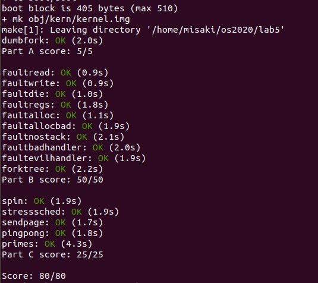
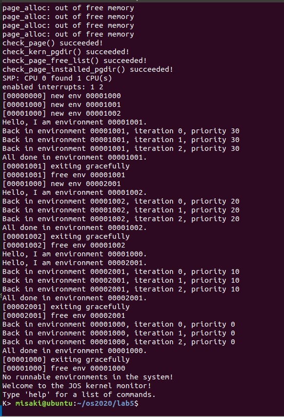
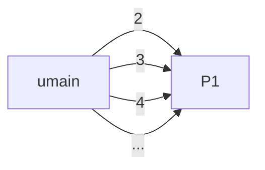
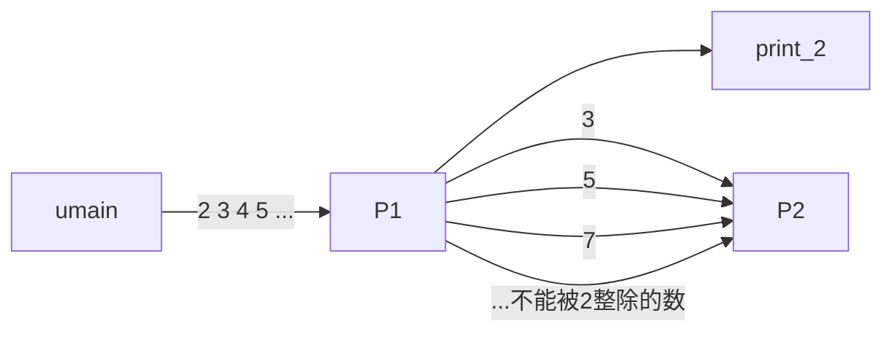
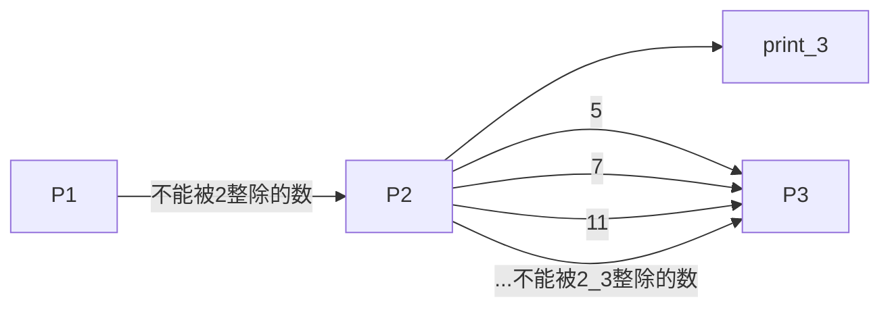
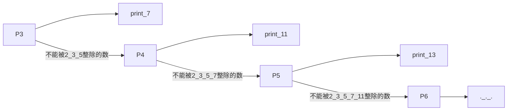

# Part A: Multiprocessor Support and Cooperative Multitasking

之前的Lab中只有一个CPU在工作，本次Lab中需要实现多处理环境。多处理器系统启动时，只有其中一个CPU启动，称为`Bootstrap Processor (BSP)`，`BSP`必须引导其它处理器的初始化。其它处理器称为`Application Processor (AP)`，具体哪个处理器成为`BSP`，由硬件决定。

## Exercise 1

处理器之间的通信通过每个处理器伴随的`APIC`实现，相当于一个`IO`设备，映射了一段地址，操作这个`IO`设备的代码主要在`kern/lapic.c`。`kern/lapic.c/lapic_init()`调用了`mmip_map_region()`管理内存映射`IO`地址，将其映射到物理地址上，其主要功能已经通过`boot_map_region()`实现了。

### `kern/pmap.c/mmio_map_region()`

根据注释的要求，参数`size`映射的内存大小应对齐`PGSIZE`，且不能映射超过地址`MMIOLIM`，权限为`PTE_W|PTE_PCD|PTE_PWT`（`PTE_P`会在`boot_map_region()`中自动设置）

#### 实现代码

```c
void * mmio_map_region(physaddr_t pa, size_t size)
{
	static uintptr_t base = MMIOBASE;

	size_t pg_size = ROUNDUP(size, PGSIZE);

	if(base + pg_size > MMIOLIM)
	{
		panic("mmio_map_region: Reservation overflow MMIOLIM\n");
		return NULL;
	}

	boot_map_region(kern_pgdir, base, pg_size, pa, PTE_W | PTE_PCD | PTE_PWT);

	void* res = (void*)base;
	base += pg_size;
	return res;
}
```

## Exercise 2

`BSP`初始化完成之后就要引导各个`AP`启动，启动操作通过`kern/init.c`的`boot_aps()`函数实现。`BSP`将引导器代码拷贝到`MPENTRY_PADDR`，并通过`APIC`令其它`AP`从该地址启动，因此需要修改`page_init()`将`MPENTRY_PADDR`处的物理页表标记为已用。

### `kern/pmap.c/page_init()`

`MPENTRY_PADDR`的值为` 0x7000`，这个地址在`npages_basemem * PGSIZE`下方，因此在设置`[PGSIZE, npages_basemem * PGSIZE)`时添加一个`if`判断即可。

#### 实现代码

```c
void page_init(void)
{
	size_t i;
	pages[0].pp_ref = 1;
	pages[0].pp_link = NULL;
	
	uint32_t npages_MPENTRY = MPENTRY_PADDR/PGSIZE;

	for (i = 1; i < npages_basemem; i++) 
	{
        // 新增的if判断，其余代码和之前相同
		if(i == npages_MPENTRY)
		{
			pages[i].pp_ref = 1;
			pages[i].pp_link  = NULL;
			continue;
		}
		pages[i].pp_ref = 0;
		pages[i].pp_link = page_free_list; 
		page_free_list = &pages[i];
	}

	uint32_t npages_IOPHYSMEM = IOPHYSMEM/PGSIZE;
	uint32_t npages_EXTPHYSMEM = EXTPHYSMEM/PGSIZE;

	for (i=npages_IOPHYSMEM ; i <npages_EXTPHYSMEM ; i++)
	{
		pages[i].pp_ref = 1;
		pages[i].pp_link = NULL;
	}

	uint32_t npages_end = ((uint32_t)boot_alloc(0) - KERNBASE) / PGSIZE; 
	
	for (i = npages_EXTPHYSMEM; i<npages_end; i++)
	{
		pages[i].pp_ref = 1;
		pages[i].pp_link = NULL;
	}
	for (i = npages_end; i < npages; i++){
		pages[i].pp_ref = 0;
		pages[i].pp_link = page_free_list; 
		page_free_list = &pages[i];
	}
}
```

## Exercise 3

多处理系统不能共享一个栈，因此需要为每个处理器分配栈空间，这是通过`mem_init_mp()`实现的，这个函数在`mem_init()`初始化`BSP`的栈后调用，为各个`AP`映射栈地址。

### `kern/pmap.c/mem_init_mp()`

根据的注释要求，需要给每个栈分配`KSTKSIZE`大小，并在之后留出`KSTKGAP`大小作为保护，使得一个栈溢出一定不会影响相邻的栈，地址映射的功能同样使用`boot_map_region()`完成，CPU的总数为8（`NCPU`），每个CPU的栈的物理地址由`PADDR(percpu_kstacks[i])`给出，权限为内核可读写，即`PTE_W`。

#### 实现代码

```c
static void mem_init_mp(void)
{
	size_t i;
	physaddr_t kstacktop_i, bootstack_i;
	for(i=0;i<NCPU;i++)
	{
		kstacktop_i = KSTACKTOP - i * (KSTKSIZE + KSTKGAP);
		boot_map_region(kern_pgdir, kstacktop_i-KSTKSIZE, KSTKSIZE, PADDR(percpu_kstacks[i]), PTE_W);
	}
}
```

> 之前已经在`kern/pmap.c/mem_init()`中把`BSP`，也就是CPU 0 的内核栈映射到了`bootstack`对应的物理地址：
>
> ```c
> boot_map_region(kern_pgdir, KSTACKTOP-KSTKSIZE, KSTKSIZE, PADDR(bootstack), PTE_W);
> ```
>
> 但是`mem_init_mp()`又把CPU 0的内核栈映射到了另一物理地址，具体可以打印出来观察：
>
> ```shell
> BSP: map 0xefff8000 to physical address 0x117000
> CPU 0: map 0xefff8000 to physical address 0x23b000
> CPU 1: map 0xeffe8000 to physical address 0x243000
> CPU 2: map 0xeffd8000 to physical address 0x24b000
> CPU 3: map 0xeffc8000 to physical address 0x253000
> CPU 4: map 0xeffb8000 to physical address 0x25b000
> CPU 5: map 0xeffa8000 to physical address 0x263000
> CPU 6: map 0xeff98000 to physical address 0x26b000
> CPU 7: map 0xeff88000 to physical address 0x273000
> ```
>
> 这里新的地址映射覆盖了旧映射，但没有修改页面引用次数。因为页面引用是对虚拟内存来讲的，因此只要虚拟地址的映射还存在，更换物理地址并不需要增加或减少页面引用，

## Exercise 4

在之前的lab中只初始化了`BSP`的`GDT`表，多处理器系统下需要为每个CPU初始化`GDT`表。

### `kern/trap.c/trap_init_percpu()`

根据注释和lab文档，当前CPU可以使用`thiscpu`获取，因此原来代码中的`ts`全部更换成`thiscpu->cpu_ts`即可。每个CPU的`TSS`位于`gdt[(GD_TSS0 >> 3) + i]`，每个CPU的栈顶在[Exercise 3](#Exercise 3)已经说明，最后`ltr()`函数的注释说明需要把`TSS selector`的低三位置`0`，`GD_TSS0`的值为`0x28`，显然不能直接使用`GD_TSS0 + i`作为其他CPU的`TSS selector`，而应该使用`GD_TSS0 + i << 3`保证低三位为`0`。

#### 实现代码

```c
void trap_init_percpu(void)
{
	thiscpu->cpu_ts.ts_esp0 = KSTACKTOP - thiscpu->cpu_id * (KSTKSIZE + KSTKGAP);
	thiscpu->cpu_ts.ts_ss0 = GD_KD;
	thiscpu->cpu_ts.ts_iomb = sizeof(struct Taskstate);

	gdt[(GD_TSS0 >> 3) + thiscpu->cpu_id] = SEG16(STS_T32A, (uint32_t) (&(thiscpu->cpu_ts)), sizeof(struct Taskstate) - 1, 0);
	gdt[(GD_TSS0 >> 3) + thiscpu->cpu_id].sd_s = 0;

	ltr(GD_TSS0 + (thiscpu->cpu_id << 3));

	lidt(&idt_pd);
}
```

## Exercise 5

这里只需要简单地按照讲义的要求添加`lock_kernel()`和`unlock_kernel()`即可。三个地方加锁，一个地方释放锁。

### `kern/init.c/i386_init()`

```c
void i386_init(void)
{
	//...
	// Acquire the big kernel lock before waking up APs
	// Your code here:
	lock_kernel();
    //...
}
```

### `kern/init.c/mp_main()`

```c
void mp_main(void)
{
	//...
	// Now that we have finished some basic setup, call sched_yield()
	// to start running processes on this CPU.  But make sure that
	// only one CPU can enter the scheduler at a time!
	//
	// Your code here:
	lock_kernel();
	sched_yield();
    //...
}
```

### `kern/trap.c/trap()`

```c
void trap(struct Trapframe *tf)
{
	//...
	if ((tf->tf_cs & 3) == 3) {
		// Trapped from user mode.
		// Acquire the big kernel lock before doing any
		// serious kernel work.
		// LAB 4: Your code here.
		lock_kernel();
		assert(curenv);
        //...
    }
}
```

### `kern/env.c/env_run()`

```c
void env_run(struct Env *e)
{
	if (curenv != NULL && curenv->env_status == ENV_RUNNING) {
		curenv->env_status = ENV_RUNNABLE;
	}
	curenv = e;
	e->env_status = ENV_RUNNING;
	e->env_runs++;
	lcr3(PADDR(e->env_pgdir));
	unlock_kernel();
	env_pop_tf(&e->env_tf);
}
```

## Exercise 6

这里需要实现一个简单的进程调度`sched_yield()`，暂时还不支持`Preemptive Multitasking`，这个调度算法依赖用户进程自动放弃处理器使用权，用户进程发出`sys_yield`系统调用，主动让内核切换到另一个进程，内核按进程创建顺序，选择下一个执行的进程。

### `kern/syscall.c/syscall()`

首先需要实现`sys_yield`调用的入口，`sys_yield()`函数不需要参数，直接调用`sched_yield()`

#### 实现代码

```c
int32_t syscall(uint32_t syscallno, uint32_t a1, uint32_t a2, uint32_t a3, uint32_t a4, uint32_t a5)
{
	int32_t ret;
	switch (syscallno) {
		//...
		case SYS_yield:
			sys_yield();
			break;
		//...
		default:
			return -E_INVAL;
	}
	return ret;
}
```

### `kern/sched.c/sched_yield() `

`sched_yield()`从当前进程开始遍历整个进程数组`envs`，找到第一个状态是`ENV_RUNNABLE`的进程，并切换到这个进程。若要是没找到其他可执行的进程，可以继续执行当前进程。若没有进程可以执行，就让处理器开始等待。

`ENVX(curenv->env_id)`可以获取当前进程在`envs`数组中的序号。对于第一次执行的情况，`curenv`为`NULL`，此时不能使用`curenv`，直接从`envs[0]`开始查找。随后进行一个长度为`NENV`的循环查找可以执行的进程。

#### 实现代码

```c
void sched_yield(void)
{
	size_t i, j, start = 0;
	
    // 当前进程的后一个进程序号
	if (curenv)
		start = ENVX(curenv->env_id) + 1;
	
    // 循环查找第一个可以运行的进程
	for (i = 0; i < NENV; i++) 
	{
		j = (start + i) % NENV;
		if (envs[j].env_status == ENV_RUNNABLE) 
			env_run(&envs[j]);
	}
	
    // 找不到其他可以运行的进程
	if (curenv && curenv->env_status == ENV_RUNNING) 
		env_run(curenv);
	
	// sched_halt never returns
	sched_halt();
}
```

## Exercise 7

`fork`是`Unix`系统常见的系统调用，`duplicate`当前进程的环境，从而启动一个新的进程。`JOS`也需要实现自己的`fork()`函数。JOS将一次`fork`拆成创建进程、修改进程状态、为进程分配并映射内存等等几个步骤，分别对应了一个系统调用。

讲义中特别说明此Exercise中调用`envid2env()`时，`checkperm`参数应为`1`。

### `kern/syscall.c/syscall()`

首先需要实现上述调用的入口，各个调用的参数按照`a1 a2 a3 a4 a5`指定即可，注意类型转换。

#### 实现代码

```c
int32_t syscall(uint32_t syscallno, uint32_t a1, uint32_t a2, uint32_t a3, uint32_t a4, uint32_t a5)
{
	int32_t ret;
	switch (syscallno) {
		case SYS_cputs:
			sys_cputs((char *)a1, (size_t)a2);
			ret = 0;
			break;
		case SYS_cgetc:
			ret = sys_cgetc();
			break;
		case SYS_getenvid:
			ret = sys_getenvid();
			break;
		case SYS_env_destroy:
			ret = sys_env_destroy((envid_t)a1);
			break;
		case SYS_page_alloc:
			ret = sys_page_alloc((envid_t)a1, (void*)a2, (int)a3);
			break;
		case SYS_page_map:
			ret = sys_page_map((envid_t)a1, (void*)a2, (envid_t)a3, (void*)a4, (int)a5);
			break;
		case SYS_page_unmap:
			ret = sys_page_unmap((envid_t)a1, (void*)a2);
			break;
		case SYS_exofork:
			ret = sys_exofork();
			break;
		case SYS_env_set_status:
			ret = sys_env_set_status((envid_t)a1, (int)a2);
			break;
		case SYS_env_set_pgfault_upcall:
			ret = sys_env_set_pgfault_upcall((envid_t)a1, (void*)a2);
			break;
		case SYS_yield:
			sys_yield();
			break;
		case SYS_ipc_try_send:
			ret = sys_ipc_try_send((envid_t)a1, (uint32_t)a2, (void*)a3, (unsigned int)a4);
			break;
		case SYS_ipc_recv:
			ret = sys_ipc_recv((void*)a1);
			break;
		default:
			return -E_INVAL;
	}

	return ret;
}
```

### `kern/syscall.c/sys_exofork()`

这个函数是对`env_alloc()`的封装，即为子进程创建运行环境，设置初始状态，复制父进程的`Trapframe`结构。但是要注意的是，父进程调用`sys_exofork()`应该返回子进程的id，但是在子进程中应该返回`0`，这和`Unix`的`fork`是一脉相承的。

`sys_exofork()`不同于其他的`sys_xxx()`函数，其用户级定义和实现在`inc/lib.h`中而不是`lib/syscall.c`中，且必须是`inline`的：

```c
// This must be inlined.  Exercise for reader: why?
static inline envid_t __attribute__((always_inline))
sys_exofork(void)
{
	envid_t ret;
	asm volatile("int %2"
		     : "=a" (ret)
		     : "a" (SYS_exofork), "i" (T_SYSCALL));
	return ret;
}
```

> 为什么必须是`inline`的？这个问题我也没弄懂

根据内联汇编语法，`"=a" (ret)`将命令执行结果输出至`%eax`，然后再由`%eax`更新`ret`的值。因在内核级`sys_exofork()`中，当子进复制父进程的`Trapframe`结构后，应该再将子进程的`Trapframe`结构的`eax`寄存器设置为`0`，然后返回子进程的id。

在`kern/trap.c/trap()`函数中调用`trap_dispatch()`处理中断时，仅仅是把内核级中断处理函数的返回值保存在了`Trapframe`的`eax`寄存器内，之后调用`env_run()`时通过`env_pop_tf(&e->env_tf)`才把`Trapframe`的`eax`值赋值给真正的`eax`寄存器。`kern/trap.c/trap()`函数返回后回到`lib/syscall.c`的用户级`syscall()`函数时，用户进程才获得真正的返回值。因此将子进程的`Trapframe`结构的`eax`寄存器设置为`0`后，`Trapframe eax`在子进程中会把`eax`设置为`0`，子进程的`sys_exofork()`函数将会返回`0`，这样就实现了父进程调用和子进程调用的返回值不同。

最后注意错误处理即可。

#### 实现代码

```c
static envid_t sys_exofork(void)
{
	struct Env* e;
	int ret = env_alloc(&e, curenv->env_id);
	
	if(ret == -E_NO_FREE_ENV)
	{
		cprintf("sys_exofork: No free environment is available\n");
		return ret;
	}
	if(ret == -E_NO_MEM)
	{
		cprintf("sys_exofork: Memory exhaustion\n");
		return ret;
	}
	e->env_status = ENV_NOT_RUNNABLE;
	e->env_tf = curenv->env_tf;
	e->env_tf.tf_regs.reg_eax = 0;

	return e->env_id;
}
```

### `kern/syscall.c/sys_env_set_status()`

这个函数是对一个`Env`结构状态赋值的封装。在赋值发生之前，内核必须做一系列检查，检查进程是否存在和要赋值的状态是否符合要求。

#### 实现代码

```c
static int sys_env_set_status(envid_t envid, int status)
{
	if(status!=ENV_RUNNABLE && status!=ENV_NOT_RUNNABLE)
	{
		cprintf("sys_env_set_status: Status is invalid\n");
		return -E_INVAL;
	}

	struct Env* e;
	int ret = envid2env(envid, &e, 1);
	if(ret == -E_BAD_ENV)
	{
		cprintf("sys_env_set_status: Environment 0x%x is inexistent\n", envid);
		return ret;
	}

	e->env_status = status;
	return 0;
}
```

### `kern/syscall.c/sys_page_alloc()`

这个函数是对`page_alloc()`和`page_insert()`的封装，用于为进程分配内存空间。使用`page_alloc()`为进程分配内存，使用`page_insert()`检查分配的地址是否已经有映射了，若是使用`page_free()`将已有映射删除。

对于错误处理的情况，考虑到之后的函数中也有相同的对`va`和`perm`的检查，因此单独实现两个检查函数`check_va()`和`check_pem()`。

`check_va()`的实现比较简单，按照注释的说明即可；在`check_perm()`中，合法的`perm`为`PTE_P | PTE_U`或`PTE_P | PTE_U | PTE_AVAIL | PTE_W`，注意到`PTE_SYSCALL`即`PTE_P | PTE_U | PTE_AVAIL | PTE_W`，故可以直接使用`PTE_SYSCALL`简化代码。

#### 实现代码

```c
static int check_va(void* va)
{
    if ((uintptr_t)va>=UTOP || (uintptr_t)va%PGSIZE!=0) 
        return -E_INVAL;

    return 0;
}
```

```c
static int check_perm(int perm)
{
    if ((perm&(PTE_U|PTE_P)) != (PTE_U|PTE_P))
        return -E_INVAL;

    if ((perm|PTE_SYSCALL) != PTE_SYSCALL)
        return -E_INVAL;

    return 0;
}
```

```c
static int sys_page_alloc(envid_t envid, void *va, int perm)
{
	struct Env* e;
	int ret = envid2env(envid, &e, 1);
	if(ret == -E_BAD_ENV)
	{
		cprintf("sys_page_alloc: Environment 0x%x is inexistent\n", envid);
		return ret;
	}

	if(check_va(va) == -E_INVAL)
	{
		cprintf("sys_page_alloc: va is invalid\n");
		return -E_INVAL;
	}

	if(check_perm(perm) == -E_INVAL)
	{
		cprintf("sys_page_alloc: perm is inappropriate\n");
		return -E_INVAL;
	}

	struct PageInfo* pp = page_alloc(ALLOC_ZERO);
	if(pp == NULL)
	{
		cprintf("sys_page_alloc: Memory exhaustion\n");
		return -E_NO_MEM;
	}

	ret = page_insert(e->env_pgdir, pp, va, perm);
	if(ret == -E_NO_MEM)
	{
		cprintf("sys_page_alloc: Memory exhaustion\n");
		page_free(pp);
		return ret;
	}
	return 0;
}
```

### `kern/syscall.c/sys_page_map()`

这个函数是对`page_lookup()`和`page_alloc()`的封装，用于建立跨进程的映射。其真正功能其实只需要`page_insert()`将虚拟地址`srcva`对应的物理页映射到虚拟地址`dstva`上。注意错误处理即可。

#### 实现代码

```c
static int sys_page_map(envid_t srcenvid, void *srcva,
	     envid_t dstenvid, void *dstva, int perm)
{
	struct Env *srce, *dste;
	int srcret = envid2env(srcenvid, &srce, 1);
	int dstret = envid2env(dstenvid, &dste, 1);
	if(srcret==-E_BAD_ENV || dstret==-E_BAD_ENV)
	{
		cprintf("sys_page_map: Srcenv or dstenv is inexistent\n");
		return -E_BAD_ENV;
	}

	if(check_va(srcva)==-E_INVAL || check_va(dstva)==-E_INVAL)
	{
		cprintf("sys_page_map: Srcva or dstva is invalid\n");
		return -E_INVAL;
	}

	pte_t* pte;
	struct PageInfo* pp = page_lookup(srce->env_pgdir, srcva, &pte);
	if(pp == NULL)
	{
		cprintf("sys_page_map: srcva is not mapped in srcenv\n");
		return -E_INVAL;
	}

	if(check_perm(perm) == -E_INVAL)
	{
		cprintf("sys_page_map: perm is inappropriate\n");
		return -E_INVAL;
	}

	if((perm&PTE_W) && !(*pte&PTE_W))
	{
		cprintf("sys_page_map: perm is inappropriate\n");
		return -E_INVAL;
	}

	int ret = page_insert(dste->env_pgdir, pp, dstva, perm);
	if(ret == -E_NO_MEM)
	{
		cprintf("sys_page_map: Memory exhaustion\n");
		return -E_NO_MEM;
	}

	return 0;
}
```

### `sys_page_unmap()`

这个函数是对`page_remove()`的封装，功能和`sys_page_map()`相反。注意错误处理即可。

#### 实现代码

```c
static int sys_page_unmap(envid_t envid, void *va)
{
	struct Env* e;
	int ret = envid2env(envid, &e, 0);
	if(ret == -E_BAD_ENV)
	{
		cprintf("sys_page_unmap: Environment 0x%x is inexistent\n", envid);
		return ret;
	}

	if(check_va(va) == -E_INVAL)
	{
		cprintf("sys_page_unmap: va is invalid\n");
		return -E_INVAL;
	}
	
	page_remove(e->env_pgdir, va);
	return 0;
}
```

# Part B: Copy-on-Write Fork

`fork`创建子进程时，把父进程的所有数据都复制到子进程中的操作会消耗大量的时间和内存，因此可以修改`fork`的功能为`Copy-on-Write`。`fork`时内核只复制页面的映射关系，而不复制其内容，同时将共享的页面标记为只读。当父子进程中任一方向内存中写入数据时，就会触发`page fault`，此时才分配一个私有的可写内存给这个进程。

## Exericse 8

为处理自己的页错误，进程需要在 JOS 注册一个`page fault handler entrypoint`，并在 `Env` 结构中的 `env_pgfault_upcall` 记录该信息。同时还需要在`kern/syscall.c/syscall()`中实现调用的入口，这里已经在[Exercise 7](#Exercise 7)中实现了

### `kern/syscall.c/sys_env_set_pgfault_upcall()`

直接设置`env_pgfault_upcall`即可，注意错误处理。

#### 实现代码

```c
static int sys_env_set_pgfault_upcall(envid_t envid, void *func)
{
	struct Env* e;
	int ret = envid2env(envid, &e, 1);
	if(ret == -E_BAD_ENV)
	{
		cprintf("sys_env_set_pgfault_upcall: Environment 0x%x is inexistent\n", envid);
		return ret;
	}

	e->env_pgfault_upcall = func;
	return 0;
}
```

## `page fault`处理机制

到目前为止，根据`inc/memlayout.h`中对虚拟地址空间的描述，JOS中一共有三个栈

- 内核态系统栈：`[KSTACKTOP, KSTACKTOP - KSTKSIZE)`
- 用户态运行栈：`[USTACKTOP, UTEXT)`
- 用户态错误处理栈：`[UXSTACKTOP, UXSTACKTOP - PGSIZE)`

内核态系统栈运行的是内核相关程序，当所有中断被触发后，CPU会自动将栈切换到内核栈上，其相关设置位于`kern/trap.c/trap_init_percpu()`中，当中断触发进入`kern/trapentry.S`中时，所处的栈已经是内核态系统栈了。

用户态运行栈是用户程序运行中使用的栈，其相关设置位于`kern/env.c/env_alloc()`中。

用户态错误处理栈是用户自己定义相应的中断处理程序后，中断处理程序运行时的栈，即用户程序使用`sys_env_set_pgfault_upcall()`向系统注册`page fault`处理程序后， 当用户程序触发缺页中断时，用户自己定义相应的中断处理程序运行时的栈。

缺页中断的触发过程可以通过`user/faultxxx.c`文件理解，以`faultdie.c`为例：

```c
#include <inc/lib.h>

void handler(struct UTrapframe *utf)
{
	void *addr = (void*)utf->utf_fault_va;
	uint32_t err = utf->utf_err;
	cprintf("i faulted at va %x, err %x\n", addr, err & 7);
	sys_env_destroy(sys_getenvid());
}

void umain(int argc, char **argv)
{
	set_pgfault_handler(handler);
	*(int*)0xDeadBeef = 0;
}
```

用户定义了自己中断处理函数`handler()`，然后在`umain()`中调用`set_pgfault_handler()`分配一个用户错误态处理栈，把全局变量`_pgfault_handler`的值设置为`handler()`函数的地址，随后触发一个`page fault`，此时会按照以下流程进行中断处理：

1. 首先系统陷入内核态，栈位置从用户运行栈切换到内核栈，从`trapentry.S`进入`trap()`函数再进入`trap_dispatch()`函数处理分发中断，并分发到`page_fault_handler()`函数内。
2. `page_fault_handler()`首先确认是由用户触发的`page fault`而不是内核触发的，然后在用户态错误栈中建立一个`UTrapframe`，但此时其实还是处于内核栈，分配空间的操作通过页表完成。
3. 随后切换到用户态错误栈，并在这个栈上运行相应的用户中断处理程序`handler()`，注意到`handler()`的参数就是一个`UTrapframe`。
4. 最后`handler()`结束后返回用户程序，栈恢复到用户态运行栈。

为了方便理解，之后我们根据`page fault`的处理过程，按照<span style="color:red">Exercise 11 --> Exercise 9 --> Exercise 10</span>的顺序完成。

## Exercise 11

`set_pgfault_hander()`是用户级函数，用于用户设置自己定义的中断处理程序，用户定义的中断处理程序运行在用户态错误处理栈上，因此当这个栈没有初始化时还需要分配栈空间。

### `lib/pgfault.c/set_pgfault_handler()`

这个函数第一次调用时，用户态错误处理栈还没有分配，因此需要为其分配栈空间，权限设置为`PTE_U | PTE_P | PTE_W`。

像`kern/trapentry.S`一样，`page fault`也有一个`Page fault upcall entrypoint`即`lib/pfentry.S`，所有用户定义的中断处理程序都会通过`lib/pfentry.S/_pgfault_upcall()`执行。因此需要调用`sys_env_set_pgfault_upcall()`设置进程的`env_pgfault_upcall`为`_pgfault_upcall()`函数的地址。

全局函数指针`_pgfault_handler`在`_pgfault_upcall()`中使用，其代表用户定义的中断处理程序的地址，因此还需要设置`_pgfault_handler`为传入的函数指针`handler`，这样`_pgfault_upcall()`才能使用`handler`处理`page fault`。

#### 实现代码

```c
void set_pgfault_handler(void (*handler)(struct UTrapframe *utf))
{
	int r;

	if (_pgfault_handler == 0) 
	{
        r = sys_page_alloc(thisenv->env_id, (void *)(UXSTACKTOP - PGSIZE), PTE_U|PTE_P|PTE_W);
        if (r < 0) 
            panic("set_pgfault_handler: Allocate user exception stack failed!\n");
    }
    sys_env_set_pgfault_upcall(thisenv->env_id, _pgfault_upcall);

	_pgfault_handler = handler;
}
```

## Exercise 9

根据[`page fault`处理机制](#`page fault`处理机制)，触发`page fault`后会陷入内核然后分发到`page_fault_handler()`函数处理中断，但是其实这个函数只是做了中断处理的准备工作，真正的处理函数用户已经定义好了，参见例子`user/faultdie.c`。

这个函数所要做的事就是将触发`page fault`的进程信息以`UTrapframe`的形式压入用户态错误处理栈，然后运行`_pgfault_upcall()`处理中断。

但是需要注意的是触发`page fault`可能是从正常栈（用户态运行栈）上触发，也可能是从异常栈（用户态错误处理栈）上触发，后者即在用户定义的`handler`程序内触发`page fault`。从正常栈上触发`page fault`后需要经内核栈切换到异常栈，但从异常栈上触发`page fault`后经内核栈会再次回到异常栈。注释中说明，前者的情况则直接在异常栈上创建一个`UTrapframe`，后者的情况则先空出一个字（4B）后再创建一个`UTrapframe`，空出的4B将在`_pgfault_upcall()`内起作用。

### `kern/trap.c/page_fault_handler()`

`page_fault_handler()`需要先检查当前进程是否设置了`page fault`处理的入口函数即`_pgfault_upcall`，以及当前`Trapframe`是否在正常栈或异常栈上，否则直接把引发`page fault`的`env`清除。

然后通过当前栈顶位置（`Trapframe esp`指针）判断进程运行在正常栈还是异常栈，如果是正常栈则直接在异常栈上创建一个`UTrapframe`，是异常栈则空出4B再创建。注释中提示使用`user_mem_assert()`，这个函数实际上完成了地址映射和检查工作。

最后将当前进程的信息保存进`UTrapframe`，并切换到异常栈上运行用户定义的`handler`程序。

`UTrapframe`的结构如下：

```c
struct UTrapframe {
	/* information about the fault */
	uint32_t utf_fault_va;	/* va for T_PGFLT, 0 otherwise */
	uint32_t utf_err;
	/* trap-time return state */
	struct PushRegs utf_regs;
	uintptr_t utf_eip;
	uint32_t utf_eflags;
	/* the trap-time stack to return to */
	uintptr_t utf_esp;
} __attribute__((packed));
```

直接把`Trapframe`和`page_fault_handler()`中定义的对应变量赋值给`UTrapframe`即可。

对于栈的切换和运行`handler`，只需要改变当前进程的`esp`和`eip`寄存器实现，但是直接更改显然是不行的，参考[sys_exofork()](#`kern/syscall.c/sys_exofork()`)中实现父子进程的返回值不同的过程，`env_run()`中调用的`env_pop_tf()`会用`Trapframe`的寄存器设置通用寄存器，而`handler`和出错的进程（即`curenv`）是处于同一进程内的，因此只要重新设置`Trapframe`的`tf_esp`为`UTrapframe`的地址，`tf_eip`为`handler`的地址，然后`env_run(curenv)`，则退出内核态后`esp`和`eip`将会改变，进程从`handler`的第一条指令开始执行，且栈也切换到了异常栈。

#### 实现代码

```c
void page_fault_handler(struct Trapframe *tf)
{
	uint32_t fault_va;

	fault_va = rcr2();

	if ((tf->tf_cs & 3) == 0)
		panic("page_fault_handler():page fault in kernel mode!\n");

	if((curenv->env_pgfault_upcall == NULL) || (tf->tf_esp>USTACKTOP && tf->tf_esp<=UXSTACKTOP-PGSIZE))
	{
		cprintf("[%08x] user fault va %08x ip %08x\n",
		curenv->env_id, fault_va, tf->tf_eip);
		print_trapframe(tf);
		env_destroy(curenv);
		return;
	}

	struct UTrapframe* utf = NULL;
	if(tf->tf_esp<UXSTACKTOP && tf->tf_esp>=UXSTACKTOP-PGSIZE)
		utf = (struct UTrapframe*)(tf->tf_esp - sizeof(struct UTrapframe) - 4);
	else
		utf = (struct UTrapframe*)(UXSTACKTOP - sizeof(struct UTrapframe));
	
	user_mem_assert(curenv, (void*)utf, sizeof(struct UTrapframe), PTE_W);

	utf->utf_esp = tf->tf_esp;
	utf->utf_eflags = tf->tf_eflags;
	utf->utf_eip = tf->tf_eip;
	utf->utf_regs = tf->tf_regs;
	utf->utf_err = tf->tf_err;
	utf->utf_fault_va = fault_va;

	tf->tf_eip = (uintptr_t)curenv->env_pgfault_upcall;
	tf->tf_esp = (uintptr_t)utf;
	env_run(curenv);
}
```

## Exercise 10

`_pgfault_upcall()`是所有用户定义的中断处理程序的入口函数，同时还需要在其执行完后，从异常栈中保存的`UTrapframe`中恢复相应信息，跳转回到发生错误之前的指令，切换到正常栈（也可能还是异常栈）恢复原来进程的运行。

`_pgfault_upcall()`调用用户定义的中断处理程序的代码如下：

```assembly
	pushl %esp			// function argument: pointer to UTF
	movl _pgfault_handler, %eax
	call *%eax
	addl $4, %esp			// pop function argument
```

用户定义的中断处理程序执行完成后，异常栈应和其调用前的结构相同，根据`lib/pfentry.S`的注释可以得到异常栈结构如下（`reserved 4 bytes`表示这是在异常栈上触发的`page fault`）

```
              <-- UXSTACKTOP
...
              <-- utf_esp
reserved 4 bytes
utf_esp       <-- %esp + 0x30
utf_eflags    <-- %esp + 0x2c
utf_eip       <-- %esp + 0x28
utf_eax       <-- %esp + 0x24 start of struct PushRegs
utf_ecx
utf_edx
utf_ebx
utf_esp
utf_ebp
utf_esi
utf_edi       <-- %esp + 0x8 end of struct PushRegs
utf_err       <-- %esp + 0x4
utf_fault_va  <-- %esp when handler is run
```

要切换栈且恢复原来进程的运行，实际上就是把`UTrapframe`保存的寄存器值直接恢复到通用寄存器内，然后设置`esp`和`eip`的值。

### `lib/pfentry.S/_pgfault_upcall()`

注释中说明了以下内容：

- 不能使用`jmp`，因为`jmp`需要一个通用寄存器保存`jmp`的地址，但所有通用寄存器都应该恢复到中断发生前的值。
- 不能直接使用`ret`，因为`ret`会修改`esp`（`ret`相当于`pop %eip`，会自动将`esp + 0x4`）
- 恢复`eflags`后不能使用任何`add, sub`指令，防止对标志位发生修改。

恢复到出错点的步骤为：

1. 从`0x28(%esp)`中取出出错时的`eip`值（`utf_eip`）临时存放到`eax`

2. 将位于`0x30(%esp)`中出错时的`esp`（`utf_esp`）的值减去`4`，使`utf_esp`指向`reserved 4 bytes`，若没有`reserved 4 bytes`则其指向栈中的`utf_esp`，即原来进程运行时的栈的栈顶

3. 从`0x30(%esp)`取出修改后的出错时的`esp - 0x4`临时存放到`%ebx`

4. 在出错时的`esp - 0x4`位置写入出错时的`eip`，即在原来进程运行时的栈的栈顶上方写入出错时的`eip`

   汇编代码如下：

```assembly
movl 0x28(%esp), %eax
subl $4, 0x30(%esp)
movl 0x30(%esp), %ebx
movl %eax, (%ebx)
```

​		此时的异常栈布局如下：

```
              <-- UXSTACKTOP
...
              <-- utf_esp
utf_eip       <-- %eax 即 utf_esp - 4
utf_esp - 4   <-- %esp + 0x30
utf_eflags    <-- %esp + 0x2c
utf_eip       <-- %esp + 0x28
utf_eax       <-- %esp + 0x24 start of struct PushRegs
utf_ecx
utf_edx
utf_ebx
utf_esp
utf_ebp
utf_esi
utf_edi       <-- %esp + 0x8 end of struct PushRegs
utf_err       <-- %esp + 0x4
utf_fault_va  <-- %esp when handler is run
```

5. 按顺序恢复`utf_regs, utf_eflags, utf_esp`到各通用寄存器（此时`utf_esp`的值为出错时的`esp - 0x04`），恢复后通用寄存器不能再使用，也不能再使用所有算术指令。

   汇编代码如下：

```assembly
# 跳过utf_fault_va和utf_err，指向utf_edi，恢复各通用寄存器
addl $8, %esp
popal
# 执行上面的指令后，esp指向utr_eip，跳过eip, 恢复eflags
addl $4, %esp
popfl
```

​		此时的异常栈布局如下：

```
              <-- UXSTACKTOP
...
              <-- utf_esp
utf_eip       
utf_esp - 4   <-- %esp
utf_eflags    
utf_eip       
```

6. 因为此时所有算术指令都不能再使用，故使用`pop %esp`弹出`utf_esp - 4`，切换为原来出错程序的运行栈，随后`esp`减去`4`指向`utf_eip`

   汇编代码如下：

```assembly
popl %esp
```

​		此时异常栈布局如下：

```
              <-- UXSTACKTOP
...
              <-- utf_esp
utf_eip       <-- %esp
utf_esp - 4   
```

7. 最后使用`ret`弹出`utf_eip`，并把`eip`设置为`utf_eip`返回原来出错的程序

#### 实现代码

```assembly
.text
.globl _pgfault_upcall
_pgfault_upcall:
	pushl %esp
	movl _pgfault_handler, %eax
	call *%eax
	addl $4, %esp

	movl 0x28(%esp), %eax
	subl $4, 0x30(%esp)
	movl 0x30(%esp), %ebx
	movl %eax, (%ebx)

	addl $0x8, %esp
	popal

	addl $0x4, %esp
	popfl

	popl %esp

	ret
```

## Exercise 12

完成对`page fault`的处理后，可以开始实现`copy-on-write`功能的`fork()`函数。`lib/fork.c`中`fork()`是主函数，`duppage()`用于复制父、子进程的页面映射，`pgfault()`是`fork`定义的中断处理程序。

注释中提到了`uvpt uvpd`两个变量，这两个变量定义在`lib/entry.S`中：

```assembly
.data
	.globl envs
	.set envs, UENVS
	.globl pages
	.set pages, UPAGES
	.globl uvpt
	.set uvpt, UVPT
	.globl uvpd
	.set uvpd, (UVPT+(UVPT>>12)*4)
```

其中`uvpt`指向`UVPT`即`0xef400000`，`uvpd`指向`UVPT+(UVPT>>12)*4)`，参考之前的lab中对JOS虚拟地址寻址方式的理解：`vaddr = PDX PTX PGOFF`，`uvpd`实际上就是把`UVPT`的高十位复制到了高11 - 20位，即复制了`PDX`部分。

关于为什么要复制`PDX`部分，在`inc/memlayout.h`中对这两个变量有进一步的解释：

```c
/*
 * The page directory entry corresponding to the virtual address range
 * [UVPT, UVPT + PTSIZE) points to the page directory itself.  Thus, the page
 * directory is treated as a page table as well as a page directory.
 *
 * One result of treating the page directory as a page table is that all PTEs
 * can be accessed through a "virtual page table" at virtual address UVPT (to
 * which uvpt is set in lib/entry.S).  The PTE for page number N is stored in
 * uvpt[N].  (It's worth drawing a diagram of this!)
 *
 * A second consequence is that the contents of the current page directory
 * will always be available at virtual address (UVPT + (UVPT >> PGSHIFT)), to
 * which uvpd is set in lib/entry.S.
 */
extern volatile pte_t uvpt[];     // VA of "virtual page table"
extern volatile pde_t uvpd[];     // VA of current page directory
```

在`[UVPT, UVPT + PTSIZE)`部分，`page directory`和`page table`其实是一样的，因此只需要使用使用`PDX`就可以寻址到`PGOFF`，且对于`uvpt`和`uvpd`有：

- `uvpd[n]`为`page directory`的第`n`个`entry`
- `uvpt[n]`为第`n`个虚拟页的`page table entry`

这里的第`n`个虚拟页，实际上就是对虚拟地址按顺序以页为单位标序号，即`n = PDX PTX`，使用宏`PGNUM(va)`即可获得序号`n`。因此若要寻址的虚拟地址为`va`，则

- `va`对应的`page directory entry`为`uvpd[PDX(va)]`
- `va`对应的`page table entry`为`uvpt[PGNUM(va)]`

### `lib/fork.c/fork()`

 `fork()`函数是三个函数的主函数，可以仿照 `user/dumbfork.c/dumbfork()` 写，但是有关键几处不同：

- 需要设置`lib/fork.c`中定义的`pgfault()`为中断处理函数
- 需要为子进程设置`page fault upcall`即向JOS注册子进程的`page fault handler entrypoint`，父进程的`page fault handler entrypoint`会在设置`pgfault()`为中断处理函数时注册
- `duppage()`的范围不同，`fork()` 只需要复制用户区的映射，即`perm`为`PTE_P|PTE_U`的映射

因此`fork()`的流程如下：

1. 父进程使用 `set_pgfault_handler()`建立父进程的用户态错误处理栈，设置`pgfault()`为父进程的中断处理函数
2. 父进程使用 `sys_exofork()` 建立一个子进程
3. 对每个在 `UTOP`（即`UXSTACKTOP`） 之下的所有用户页面，父进程调用 `duppage()` 将其映射关系复制到子进程，但不能复制`[UXSTACKTOP-PGSIZE, UXSTACKTOP)`之间的用户态错误处理栈，这样父子进程的虚拟地址都映射到相同的物理地址上。
4. 至此子进程已经可以运行了，但是子进程也可能出现`page fault`，因此需要在父进程中完成对子进程[set_pgfault_handler()](#lib/pgfault.c/set_pgfault_handler())的工作，即为子进程分配用户态错误处理栈空间（正好填补了`duppage()`没有复制的一个`page`），为子进程设置`page fault handler entrypoint`，但由于`set_pgfault_handler()`只能为当前进程所使用，因此这里需要单独使用`sys_page_alloc()`和`sys_env_set_pgfault_upcall()`。
5. 子进程已经就绪，父进程将其设为`RUNNABLE`

#### 实现代码

这里使用了`uvpt`、`uvpd`、`_pgfault_upcall`三个外部变量，故需要在`lib/fork.c`开头声明

```c
extern volatile pte_t uvpt[];
extern volatile pde_t uvpd[];
extern void _pgfault_upcall(void);
```

```c
envid_t fork(void)
{
	set_pgfault_handler(pgfault);
	envid_t envid = sys_exofork();

	if (envid < 0)
		panic("fork: Fork child env %e failed\n", envid);
	if (envid == 0) 
	{
		thisenv = &envs[ENVX(sys_getenvid())];
		return 0;
	}

	uintptr_t addr;
	for (addr = UTEXT; addr < UXSTACKTOP-PGSIZE; addr += PGSIZE)
		if((uvpd[PDX(addr)]&PTE_P) && (uvpt[PGNUM(addr)]&(PTE_P|PTE_U)))
			duppage(envid, PGNUM(addr));

	int ret = sys_page_alloc(envid, (void*)(UXSTACKTOP-PGSIZE), PTE_U|PTE_P|PTE_W);
	if(ret < 0)
		panic("fork: Page alloc failed\n");

	ret = sys_env_set_pgfault_upcall(envid, _pgfault_upcall);
	if(ret < 0)
		panic("fork: Set pgfault upcall failed\n");

	ret = sys_env_set_status(envid, ENV_RUNNABLE);
	if(ret < 0)
		panic("fork: Set status failed\n");

	return envid;
}
```

### `lib/fork.c/duppage()`

`duppage()`的功能是复制父、子进程的页面映射关系，其实就是使用`sys_page_map()`将子进程的虚拟地址映射到对应父进程的虚拟地址映射到的物理地址上。

传入参数`envid`应为子进程id，故还需要使用`sys_getenvid()`获取父进程id（因为`duppage()`是在父进程中调用的），`pn`代表虚拟页序号，`uvpt[pn]`获得其`page table entry`，从`page table entry`的低12可获取需要复制的页面的`perm`。注释中说明，如果页面的`perm`为`PTE_W`或被`PTE_COW`标记，则需要标记为`PTE_COW`，为了让子进程能够触发中断，还需要为`perm`添加`PTE_SYSCALL`权限。

最后使用`sys_page_map()`建立映射关系，由于`sys_page_map()`中使用`page_insert()`插入映射关系时，会删除已有映射关系，因此父进程将自身的页面映射到子进程的地址空间后，还需要再使用`sys_page_map()`将它们重新映射到自己的地址空间。

#### 实现代码

```c
static int duppage(envid_t envid, unsigned pn)
{
	int r;

	// LAB 4: Your code here.
	//panic("duppage not implemented");
	envid_t eid = sys_getenvid();
	void* va = (void*)(pn*PGSIZE);
	int perm = uvpt[pn]&0xfff;
	if((perm&PTE_W) || (perm&PTE_COW))
	{
		perm |= PTE_COW;
		perm &= ~PTE_W;
	}

	perm &= PTE_SYSCALL;

	r = sys_page_map(eid, va, envid, va, perm);
	if(r < 0)
		panic("duppage: Page map failed\n");

	r = sys_page_map(eid, va, eid, va, perm);
	if(r < 0)
		panic("duppage: Page map failed\n");

	return 0;
}
```

### `lib/fork.c/pgfault()`

`pafault()`是用户定义的用来处理`fork()`中发生`page fault`的函数，`fork()`只复制了映射关系，当父子进程之一往一个`PTE_COW`标记的页面写入内容时，会发生`page fault`，其处理流程为：

1. 检查错误类型，以及页面是否标记为`PTE_COW`
2. 分配一个新的页面并将发生`page fault`的内容复制进去，然后将旧的映射覆盖，使其映射到该新页面，使父子进程的数据独立。

根据注释，`FEC_WR`表示`copy-on-write`的错误代码，发生错误的页面的`perm`信息可以通过`uvpt[PGNUM(addr)]`获得，`addr`为出错的虚拟地址。然后分配新页面并映射到虚拟地址`PFTEMP`，通过 `memmove()` 函数将 `addr` 所在页面拷贝至 `PFTEMP`，此时有两个物理页保存了同样的内容。然后删除`addr`的映射，再将 `addr` 映射到 `PFTEMP` 对应的物理页，最后删除 `PFTEMP` 的映射，此时就只有 `addr` 指向新分配的物理页了，如此就完成了错误处理。

#### 实现代码

```c
static void pgfault(struct UTrapframe *utf)
{
	void *addr = (void *) utf->utf_fault_va;
	uint32_t err = utf->utf_err;
	int r;

	if((err&FEC_WR)==0 || (uvpt[PGNUM(addr)]&PTE_COW)==0)
		panic("pgfault: Invalid user trapframe\n");

	envid_t envid = sys_getenvid();
	r = sys_page_alloc(envid, (void*)PFTEMP, PTE_U|PTE_P|PTE_W);
	if(r < 0)
		panic("pgfault: Page alloc failed\n");

	addr = ROUNDDOWN(addr, PGSIZE);
	memmove(PFTEMP, addr, PGSIZE);

	r = sys_page_unmap(envid, addr);
	if(r < 0)
		panic("pgfault: Page unmap failed\n");

	r = sys_page_map(envid, PFTEMP, envid, addr, PTE_U|PTE_P|PTE_W);
	if(r < 0)
		panic("pgfault: Page map failed\n");

	r = sys_page_unmap(envid, PFTEMP);
	if(r < 0)
		panic("pgfault: Page unmap failed\n");
}
```

# Part C: Preemptive Multitasking and Inter-Process communication (IPC)

这一部分需要实现抢占调度，以及进程间通信。

## Exercise 13

对于外部中断(IRQ)，JOS在`inc/trap.h`中定义了六种：

```c
#define IRQ_TIMER        0
#define IRQ_KBD          1
#define IRQ_SERIAL       4
#define IRQ_SPURIOUS     7
#define IRQ_IDE         14
#define IRQ_ERROR       19
```

其在`idt`表的位置通过偏移`IRO_OFFSET`寻址，首先需要像之前的lab一样定义中断处理的入口。

### `kern/trapentry.S`

仿照之前的lab即可，由于所有外部中断CPU都不会自动压入`error code`，故需要使用`TRAPHANDLER_NOEC`定义。

#### 实现代码

```c
	TRAPHANDLER_NOEC(th_irq_timer, IRQ_OFFSET + IRQ_TIMER)
	TRAPHANDLER_NOEC(th_irq_kbd, IRQ_OFFSET + IRQ_KBD)
	TRAPHANDLER_NOEC(th_irq_serial, IRQ_OFFSET + IRQ_SERIAL)
	TRAPHANDLER_NOEC(th_irq_spurious, IRQ_OFFSET + IRQ_SPURIOUS)
	TRAPHANDLER_NOEC(th_irq_ide, IRQ_OFFSET + IRQ_IDE)
	TRAPHANDLER_NOEC(th_irq_error, IRQ_OFFSET + IRQ_ERROR)
```

### `kern/trap.c/trap_init()`

仿照之前的lab即可，宏`SETGATE(gate, istrap, sel, off, dpl)` ，中`istrap`设置`0`代表中断，`dpl`设置`0`代表只能在内核级触发。

#### 实现代码

```c
void trap_init(void)
{
	extern struct Segdesc gdt[];
	//...
	void th_irq_timer();
	void th_irq_kbd();
	void th_irq_serial();
	void th_irq_spurious();
	void th_irq_ide();
	void th_irq_error();
	//...
	SETGATE(idt[IRQ_OFFSET + IRQ_TIMER], 0, GD_KT, th_irq_timer, 0);
	SETGATE(idt[IRQ_OFFSET + IRQ_KBD], 0, GD_KT, th_irq_kbd, 0);
	SETGATE(idt[IRQ_OFFSET + IRQ_SERIAL], 0, GD_KT, th_irq_serial, 0);
	SETGATE(idt[IRQ_OFFSET + IRQ_SPURIOUS], 0, GD_KT, th_irq_spurious, 0);
	SETGATE(idt[IRQ_OFFSET + IRQ_IDE], 0, GD_KT, th_irq_ide, 0);
	SETGATE(idt[IRQ_OFFSET + IRQ_ERROR], 0, GD_KT, th_irq_error, 0);
	
	// Per-CPU setup 
	trap_init_percpu();
}
```

### `kern/env.c/env_alloc()`

讲义中说明JOS是通过`eflags`中的`FL_IF`是否置位决定外部中断是否开启，因此需要将其置位。

#### 实现代码

```c
int env_alloc(struct Env **newenv_store, envid_t parent_id)
{
	//...
	// Enable interrupts while in user mode.
	// LAB 4: Your code here.
	e->env_tf.tf_eflags |= FL_IF;
    //...
}
```

### `kern/sched.c/sched_halt()`

由于在`bootloader`的第一条指令 `cli` 关闭了中断，因此需要通过`sit`指令再次开启。

```c
void sched_halt(void)
{
	//...
	asm volatile (
		"movl $0, %%ebp\n"
		"movl %0, %%esp\n"
		"pushl $0\n"
		"pushl $0\n"
		// Uncomment the following line after completing exercise 13
		"sti\n"
		"1:\n"
		"hlt\n"
		"jmp 1b\n"
	: : "a" (thiscpu->cpu_ts.ts_esp0));
    //...
}
```

## Exercise 14

为了防止进程一直占用CPU，硬件需要周期性地产生`clock interrupt`，强制将控制权交给`kernel`，使得能够切换到其他进程。

### `kern/trap.c/trap_dispatch()`

产生`clock interrupt`可以通过`lapic_eio()`函数，时钟中断并不需要中断处理函数，直接使用`sched_yield()`调度其他进程运行即可。

#### 实现代码

```c
static void trap_dispatch(struct Trapframe *tf)
{
    //...
	// Handle clock interrupts. Don't forget to acknowledge the
	// interrupt using lapic_eoi() before calling the scheduler!
	// LAB 4: Your code here.
	if(tf->tf_trapno == IRQ_OFFSET + IRQ_TIMER)
	{
		lapic_eoi();
		sched_yield();
		return;
	}
    //...
}
```

## Exercise 15

为了实现IPC，JOS在`Env`结构中增加了五个成员：

```c
struct Env{
    //...
	bool env_ipc_recving;		// Env is blocked receiving
	void *env_ipc_dstva;		// VA at which to map received page
	uint32_t env_ipc_value;		// Data value sent to us
	envid_t env_ipc_from;		// envid of the sender
	int env_ipc_perm;		// Perm of page mapping received
    //...
}
```

IPC通过四个函数实现，两个系统调用：`sys_ipc_recv()` 和 `sys_ipc_try_send()` ，以及它们封装成的两个库函数：`ipc_recv()` 和 `ipc_send()` ，后者是用户级进程调用的函数。

进程使用 `sys_ipc_recv()` 来接收消息。该系统调用会将程序挂起，让出CPU资源，直到收到消息。在这个时期，任一进程都能给他发送信息，不限于父子进程。当进程调用 `sys_ipc_recv()` 并提供一个虚拟地址 `dstva` 时，进程表示它希望接收一个页面映射。如果发送者发送一个页面，该页面就会被映射到接收者的 `dstva`。同时，之前 `dstva` 的映射会被覆盖。

为了发送信息，进程会调用 `sys_ipc_try_send()`，以接收者的进程id以及要发送的值为参数。如果接收者已经调用了 `sys_ipc_recv()` ，则成功发送消息并返回0。否则返回 `E_IPC_NOT_RECV` 表明目标进程并没有接收消息。当进程调用 `sys_ipc_try_send()` 并提供一个虚拟地址 `srcva`，表明发送者希望发送位于 `srcva` 的页面给接收者，权限为参数 `perm`。

`ipc_revc()`和`ipc_send()`直接封装以上两个函数，其中`ipc_send()` 函数将会反复执行 `sys_ipc_try_send` 直到成功。在一个包含页面映射的IPC成功之后，发送者和接受者将共享一个物理页。

### `kern/syscall.c/sys_ipc_try_send()`

`sys_ipc_try_send()`函数的功能和`sys_page_map()`的功能很相似，需要建立两个进程间的地址映射，然后设置目的进程的IPC数据结构，其中`env_ipc_recving`在进程调用`sys_ipc_recv()`时会被置为`1`，发送进程会把目的进程的`env_ipc_recving`重新置为`0`。

为了保证两个进程都返回`0`，参考[sys_exofork()](# `kern/syscall.c/sys_exofork()`)，将目的进程的`Trapframe`结构的`eax`设置为`0`即可。错误处理和`sys_map_map()`基本相同。

#### 实现代码

```c
static int sys_ipc_try_send(envid_t envid, uint32_t value, void *srcva, unsigned perm)
{
	struct Env* dste;
	int ret = envid2env(envid, &dste, 0);
	
	if(ret < 0)
	{
		cprintf("sys_ipc_try_send: Environment 0x%x is inexistent\n", envid);
		return ret;
	}
	
	if(!dste->env_ipc_recving)
	{
		//cprintf("sys_ipc_try_send: Environment 0x%x is receiving\n");
		return -E_IPC_NOT_RECV;
	}
	
	if((uintptr_t)srcva < UTOP)
	{
		
		if(((uintptr_t)srcva%PGSIZE != 0))
		{
			cprintf("sys_ipc_try_send: srcva is not aligned\n");
			return -E_INVAL;
		}
		
		if(check_perm(perm) == -E_INVAL)
		{
			cprintf("sys_ipc_try_send: perm is inappropriate\n");
			return -E_INVAL;
		}
		
		pte_t *pte;
		struct PageInfo* pp = page_lookup(curenv->env_pgdir, srcva, &pte);
		if(pp == NULL)
		{
			cprintf("sys_ipc_try_send: srcva is not mapped in curenv\n");
			return -E_INVAL;
		}
		
		if((perm & PTE_W) && !((*pte) & PTE_W))
		{
			cprintf("sys_ipc_try_send: perm is inappropriate\n");
			return -E_INVAL;
		}
		if((uintptr_t)dste->env_ipc_dstva < UTOP)
		{
			ret = page_insert(dste->env_pgdir, pp, dste->env_ipc_dstva, perm);
			if(ret < 0)
			{
				cprintf("sys_ipc_try_send: Memory exhaustion\n");
				return ret;
			}
		}
	}
	
	dste->env_ipc_recving = 0;
	dste->env_ipc_value = value;
	dste->env_ipc_from = curenv->env_id;
	dste->env_ipc_perm = perm;
	dste->env_status = ENV_RUNNABLE;
	dste->env_tf.tf_regs.reg_eax = 0;
	return 0;
}
```

### `kern/syscall.c/sys_ipc_recv()`

这个函数用于接收进程的接收前准备工作，需要注意如果`dstva`在`UTOP`之上的情况并不需要返回错误代码，只需要忽略即可，这种情况表明接收者只需要接收值，而不需要发送者映射页面。

#### 实现代码

```c
static int sys_ipc_recv(void *dstva)
{
	if((dstva<(void *)UTOP) && ((uintptr_t)dstva%PGSIZE!=0))
		return -E_INVAL;
	
	curenv->env_ipc_recving = 1;
	curenv->env_status = ENV_NOT_RUNNABLE;
	curenv->env_ipc_dstva = dstva;
	curenv->env_ipc_from = 0;
	sys_yield();
	
	return 0;
}
```

### `lib/ipc.c/ipc_recv()`

`ipc_rev()`的主要功能已经通过`sys_ipc_recv()`实现了，参数`pg`表示接受者希望发送者将其页面映射到的地址，即`sys_ipc_recv()`的参数。需要注意的是如果参数`pg`未设置，则表示接收者不需要发送者映射页面，根据`sys_ipc_recv()`对`dstva`的检查，可以`pg`设置为`UTOP`上方的地址即可。

#### 实现代码

```c
int32_t ipc_recv(envid_t *from_env_store, void *pg, int *perm_store)
{
	if(!pg)
		pg = (void *)UTOP;
	
	int ret = sys_ipc_recv(pg);
	if(ret < 0)
	{
		if(from_env_store)
			*from_env_store = 0;
		if(perm_store)
			*perm_store = 0;
		return ret;
	}

	if(from_env_store)
		*from_env_store = thisenv->env_ipc_from;
	if(perm_store)
		*perm_store = thisenv->env_ipc_perm;
	return thisenv->env_ipc_value;
}
```

### `lib/ipc.c/ipc_send()`

`ipc_send()` 函数需要反复执行 `sys_ipc_try_send()` 直到成功，若两个进程不需要共享页面则把`pg`设置一个特定值，根据前面的说明`pg`设置为`UTOP`上方的地址即可。

#### 实现代码

```c
void ipc_send(envid_t to_env, uint32_t val, void *pg, int perm)
{
	if(!pg)
		pg = (void *)UTOP;
	int ret;
	while((ret = sys_ipc_try_send(to_env, val, pg, perm)) < 0)
	{
		if(ret != -E_IPC_NOT_RECV)
		{
			panic("sys_ipc_send: %e\n", ret);
		}
		sys_yield();
	}
}
```

# `make grade`运行结果



# 优先级调度算法

**仿照`sched_yield()`函数为JOS添加一个新的调度算法：优先级调度算法。你需要能为每个进程设置优先级（数值越大表示优先级越高），且你的调度算法会保证优先级越高的程序越先被执行。除此以外，你还需要编写测试程序来验证你代码的正确性**

首先在`inc/env.h`中的`Env`结构中添加一个新成员` int env_priority`，并定义几个内置的优先级宏变量：

```c
#define PRIOR_SUPREME 30
#define PRIOR_HIGH 20
#define PRIOR_LOW 10
#define PRIOR_DEFAULT 0
```

然后在`kern/env.c`的`env_alloc()`中增加一行在创建进程时设置默认优先级的代码：

```
e->env_priority = PRIOR_DEFAULT;
```

再添加系统调用`sys_env_set_priority()`以便用户设置进程的优先级，这个函数和`sys_env_set_status`的实现过程一模一样，需要修改四个文件：

- `inc/syscall.h`
- `lib/syscall.c`
- `lib/lib.h`
- `kern/syscall.c`

以下只展示内核级`kern/syscall.c/sys_env_set_priority()`的代码，其余文件的修改非常简单，仿照`sys_env_set_status`即可。

```c
static int sys_env_set_priority(envid_t envid, int priority)
{
	struct Env* e;
	int ret = envid2env(envid, &e, 1);
	if(ret == -E_BAD_ENV)
	{
		cprintf("sys_env_set_priority: Environment 0x%x is inexistent\n", envid);
		return ret;
	}
	e->env_priority = priority;
	return 0;
}
```

优先级调度算法的实现如下，修改`kern/sched.c/sched_yield()`：

`max_priority_env()`函数负责在`envs`数组中找到优先级不小于`curprio`的最大优先级的可运行进程的位置，优先级相同时取位置最大的，若找不到可运行的进程则返回`-1`

```c
int max_priority_env(int curprio)
{
	int max_pos = -1, i;
	for(i=0; i<NENV; i++)
	{
		if(envs[i].env_status==ENV_RUNNABLE || envs[i].env_status==ENV_RUNNING)
		{	
			if(envs[i].env_priority>=curprio)
			{
				max_pos = i;
				curprio = envs[i].env_priority;
			}
		}
	}
	return max_pos;
}
```

`sched_yield()`中，首先对`curenv`是否存在判断，若存在则记录其优先级然后进入`while`循环中进行优先级调度；若`curenv`不存在则先选择一个可运行的最大优先级进程运行，再进入`while`循环中进行优先级调度。

在`while`循环中，每次找到优先级不小于`curprio`的最大优先级的进程运行，其至少可以找到处于`ENV_RUNNING`的自身，否则表示没有进程可以运行，退出循环。

```c
void
sched_yield(void)
{
	//priority-scheduling
	int curprio = 0, max_pos = -1;

	if (curenv)
	{
		curprio = curenv->env_priority;
	}
	else
	{
		max_pos = max_priority_env(curprio);
		if (max_pos >= 0)
		{
			env_run(&envs[max_pos]);
		}
	}

	bool done = false;
	while (!done)
	{
		max_pos = max_priority_env(curprio);
		if (max_pos >= 0)
		{
			env_run(&envs[max_pos]);
		}
		else
		{
			done = true;
		}
	}
	
	sched_halt();
}
```

测试程序`user/myyield.c`，思路和`user/yield.c`一样，父进程创建3个子进程，并分别设置不同的优先级，然后开始`sched_yield()`。

```c
#include <inc/lib.h>

void umain(int argc, char **argv)
{
	int id;
	sys_env_set_priority(thisenv->env_id, PRIOR_DEFAULT);
	
	if((id = fork()) != 0)
	{
		sys_env_set_priority(id, PRIOR_SUPREME);

		if((id = fork()) != 0)
		{
			sys_env_set_priority(id, PRIOR_HIGH);

			if((id = fork()) != 0)
			{
				sys_env_set_priority(id, PRIOR_LOW);
			}
		}
	}

	cprintf("Hello, I am environment %08x.\n", thisenv->env_id);
	int i;
	for(i=0; i<3; i++)
	{
		sys_yield();
		cprintf("Back in environment %08x, iteration %d, priority %d\n", sys_getenvid(),i, thisenv->env_priority);
	}
	cprintf("All done in environment %08x.\n", thisenv->env_id);
}
```

## 运行结果

测试方法为修改`kern/init.c`设置`ENV_CREATE(user_myyield, ENV_TYPE_USER)`（`sched_yield()`中把原来的调度算法注释掉，切换成优先级调度算法）



# 问题回答

## Q1

**详细描述JOS启动多个APs（Application Processors）的过程**

对比之前的lab中的`kern/init.c/i386_init()`函数，多处理器系统增加了以下内容

```c
void i386_init(void)
{
    //...
	mp_init();
	lapic_init();

	pic_init();

	lock_kernel();

	boot_aps();
    //...
}
```

`boot_aps()`之前都是在进行多处理器系统初始化。

### `mp_init()`

`mp_init()`从内存的BIOS区域中读取MP配置表获得多处理器系统的信息，例如CPU的总数、它们的APIC ID、LAPIC的MMIO地址等。

### `lapic_init()`

`lapic_init()`主要对LAPIC的一些寄存器进行设置，包括设置ID，version，以及禁止所有CPU的NMI(LINT1)，BSP的LAPIC以Virtual Wire Mode运行，开启BSP的LINT0，以用于接收8259A芯片的中断等。

### `pic_init()`

`pic_init()`用于初始化8259A芯片的中断控制器。8259A芯片是一个中断管理芯片，中断来源除了来自硬件本身的NMI中断以及软件的`INT n`指令造成的软件中断外，还有来自外部硬件设备的中断(INTR)，这些外部中断是可以屏蔽的。而这些中断的管理都是通过PIC（可编程中断控制器）来控制并决定是否传递给CPU，JOS中开启的INTR中断号有1和2。

### `boot_aps()`

`boot_aps()`首先通过`memmove()`将`mpentry_start`开始的一段代码（其实就是`kern/mpentry.S`的代码）拷贝到`MPENTRY_PADDR`对应的虚拟地址处，设置好对应该CPU的栈顶指针，然后调用`kern/lapic.c/lapic_startap()`开始启动AP。

### `lapic_startap()`

`lapic_startap()`完成LAPIC的设置，设置`warm reset vector`指向`mpentry.S`代码的起始位置，发送`STARTUP IPI`以触发AP开始运行`mpentry.S`的代码，并等待AP启动完成，一个AP启动完成后再启动下一个。

### `mpentry.S`

`mpentry.S`的代码的作用类似`boot.S`（即bootloader）。`mpentry.S`在加载`GDT`和跳转时用到了宏定义`MPBOOTPHYS`，因为`mpentry.S`代码是加载在`KERNBASE`之上的，在CPU实模式下无法寻址到这些高地址，所以需要转换为物理地址，而`boot.S`的代码不用转换，是因为它们本身就加载在实模式。其他流程跟`boot.S`类似，也是开启保护模式和分页，最后是跳转到`mp_main()`函数执行初始化。

### `mp_main()`

`mp_main()`函数先是加载了`kern_pgdir`到`CR3`寄存器中，然后调用`lapic_init()`、`env_init_percpu()`、`trap_init_percpu()`为每个CPU初始化进程相关内容和中断相关内容，最后使用`xchg()`设置CPU状态为`CPU_STARTED`让`BSP`去启动下一个CPU。lab4中添加的`lock_kernel()`用于保证多处理器操作的原子性。

## Q2

**详细描述：**

1. **在JOS中，执行COW（Copy-On-Write）fork时，用户程序依次执行了哪些步骤？这些步骤包含了哪些系统调用？**
2. **当进程发生COW相关的page fault时，这个中断是被如何处理的？其中哪些步骤在内核中，哪些步骤在用户空间中？**

### a

用户级`fork()`的基本流程如下：

1. 父进程调用`set_pgfault_handler()`，将`pgfault()`设置为`page fault`中断处理函数（即设置`handler`的值），并为父进程分配用户态错误处理栈空间。
2. 父进程调用`sys_exofork()`创建子进程，并在子进程内调用`sys_getenvid()`获取子进程id以设置`thisenv`指针。
3. 对任意在`UTOP`下方有写权限或`PTE_COW`标记的页面，父进程调用`duppage()`将其映射到子进程的地址空间（只复制映射关系），然后将它们重新映射到自己的地址空间。`duppage()`函数为所有复制的映射关系添加权限为只读并使用`PTE_COW`标记。

4. 父进程为子进程分配用户态错误处理栈空间，并注册`page fault handler entrypoint`，即`set_pgfault_handler()`函数所做的工作。
5. 父进程设置子进程的状态为`RUNABLE`，子进程运行。

以上步骤中使用了系统调用`sys_env_set_pgfault_upcall()`、`sys_exofork()`、`sys_getenvid()`、`sys_page_map()`、`sys_page_alloc()`、`sys_env_set_status()`

### b

用户态`page fault`中断处理过程：
1. 【用户态】发生异常前，用户通过`set_pgfault_handler()`已经向内核注册自己定义的中断处理程序，并为自己的用户态错误处理栈分配一个`page`。
2. 【内核态】用户态下发生`page fault`，陷入内核态切换到内核栈，进入`trap()`通过一系列函数分发到`page_fault_handler()`处理中断。
3. 【内核态】`page_fault_handler()`检测`Trapframe`的`tf_cs`是否为用户态发生的`page fault`，然后在用户态错误栈中分配一个`UTrapframe`，随后设置`esp`和`eip`，切换到用户态错误栈，并运行`pfentry.S`的代码。
4. 【用户态】`pfentry.S`在用户态错误处理栈上运行，并调用用户定义的中断处理程序。
5. 【用户态】用户定义的中断处理程序结束后，返回`pfentry.S`内恢复`esp`和`eip`。
6. 【用户态】`pfentry.S`的代码最后，栈切换到用户态运行栈，返回用户进程出错前的指令开始运行。

## Q3

**`user/primes.c`这段代码非常有趣，请详细解释一下这段代码是如何执行的，画出代码流程图，并指出所谓的“素数”体现在哪里**

```flow
flowchat
st=>start: umain start
op=>operation: id = fork()
op2=>operation: panic
sub=>subroutine: (in child process)primeproc()
op3=>operation: (never end)loop: ipc_send to child process
cond=>condition: id < 0
cond2=>condition: id == 0

st->op->cond
cond(no)->cond2
cond(yes)->op2
cond2(yes)->sub
cond2(no)->op3
```

```flow
flowchat
st=>start: primeproc start
op4=>operation: ipc_recv vaule p from parent process
io=>inputoutput: print p
op5=>operation: in child process
op6=>operation: id = fork()
cond3=>condition: id < 0
cond4=>condition: id == 0
op7=>operation: panic
op8=>operation: ipc_recv vaule i from parent process
cond5=>condition: i % p == 0
op9=>operation: ipc_send i to child process

st->op4->io->op6->cond3
cond3(yes)->op7
cond4(yes)->op5(left)->op4
cond3(no)->cond4
cond4(no)->op8(bottom)->cond5
cond5(no)->op9->op8
cond5(yes)->op8
```


首先执行`umain()`函数，`umain`作为第一个进程，其创建一个子进程`P1`。子进程调用`primeproc()`；`umain`不调用`primeproc()`，而是向`P1`从`2`开始递增发送数据。

初始情况如下：



在子进程`P1`中，`P1`通过`ipc_recv()`接收`umain`发送的第一个数据`2`设置`p`的值，并`cprintf()`输出，然后创建一个子进程`P2`。`P1`进入无限循环调用`ipc_recv()`接收`umain`接下来发送的数字`3 4 5 ...`，当接收到的数字`i`不能被第一个接收到的数字`p`整除时，将`i`发送给子进程`P2`。

此时情况如下：



`P2`重复`P1`的步骤，但此时`P2`内的`p`为`3`，故`P2`会把不能被`2`和`3`整除的数字发送给`P3`

此时情况如下：



以此类推

- `P3`将会输出第一个不能被`2`、`3`整除的数字`5`，然后向`P4`发送不能被`2`、`3`、`5`整除的数字
- `P4`将会输出第一个不能被`2`、`3`、`5`整除的数字`7`，然后向`P5`发送不能被`2`、`3`、`5`、`7`整除的数字
- `P3`将会输出第一个不能被`2`、`3`、`5`、`7`整除的数字`11`，然后向`P4`发送不能被`2`、`3`、`5`、`7`、`11`整除的数字
- ...



因此每次传递到下一层的数字将不能被已经输出的所有数字整除，下一层输出的数字是不能被已经输出的所有数字整除的数中最小的一个，故所有输出的数字都是素数。

