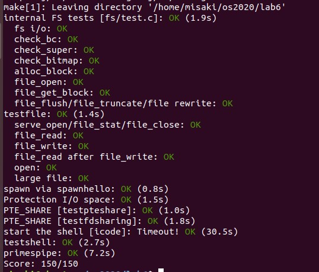

# The File System

## Disk Access

我们先通过`fs/fs.h`看下文件系统实现的一些细节。

```c
/* ide.c */
bool	ide_probe_disk1(void);
void	ide_set_disk(int diskno);
void	ide_set_partition(uint32_t first_sect, uint32_t nsect);
int	ide_read(uint32_t secno, void *dst, size_t nsecs);
int	ide_write(uint32_t secno, const void *src, size_t nsecs);

/* bc.c */
void*	diskaddr(uint32_t blockno);
bool	va_is_mapped(void *va);
bool	va_is_dirty(void *va);
void	flush_block(void *addr);
void	bc_init(void);

/* fs.c */
void	fs_init(void);
int	file_get_block(struct File *f, uint32_t file_blockno, char **pblk);
int	file_create(const char *path, struct File **f);
int	file_open(const char *path, struct File **f);
ssize_t	file_read(struct File *f, void *buf, size_t count, off_t offset);
int	file_write(struct File *f, const void *buf, size_t count, off_t offset);
int	file_set_size(struct File *f, off_t newsize);
void	file_flush(struct File *f);
int	file_remove(const char *path);
void	fs_sync(void);
```

从这里可以看到文件系统实现细节被分成了三个大模块：

- `ide.c`：提供IDE磁盘的驱动，比如对特定扇区(sector)的读写以及切换操作磁盘。
- `bc.c`：提供磁盘的块缓存实现机制，由于JOS的磁盘最大可以支持3GB，但不可能同时全部使用，所以用户请求读写一块磁盘区域时，将其加载到文件系统进程的虚拟地址里，这样就可以使用较小的内存操作很大一块磁盘。`fs/bc.c`就是专门为文件系统服务进程实现这部分功能的模块。
- `fs.c`：文件系统的核心功能，例如文件的增删读写。

## Exercise 1

讲义中说明JOS在创建环境时使用`ENV_TYPE_FS`标识文件系统环境，当使用`env_create()`创建文件系统环境时，需要赋予其I/O权限。

### `kern/env.c/env_create()`

根据`type`参数判断是否为文件系统环境，若是将`eflags`的`FL_IOPL_MASK`置位。

#### 实现代码

```c
void env_create(uint8_t *binary, enum EnvType type)
{
	struct Env *e;
	int r;
	if ((r = env_alloc(&e, 0) != 0)) {
		panic("create env failed\n");
	}
	if(type == ENV_TYPE_FS)
		e->env_tf.tf_eflags |= FL_IOPL_MASK;
	
	load_icode(e, binary);
	e->env_type = type;
}
```

## The Block Cache

这里描述了磁盘块缓冲的具体机制：

JOS支持的磁盘大小最大为3GB，我们可以通过类似之前的lab中实现的`fork()`的COW页面机制处理磁盘读写：

1. 用文件系统服务进程的虚拟地址空间（4GB）映射到磁盘的地址空间（3GB）
2. 初始文件系统服务进程里没有页面映射，访问一个磁盘的地址空间会发生页错误
3. 在页错误处理程序中，在内存中申请一个块的空间映射到对应文件系统服务进程的虚拟地址上，然后去实际的物理磁盘上读取这个区域的内容到这个内存区域上，然后恢复文件系统进程

这样就使用用户进程的机制完成了对物理磁盘的读写机制，并尽量减少了内存的使用。

## Exercise 2

首先我们要实现的是磁盘块缓冲的页面处理部分和写回部分，这里主要使用和磁盘交互的IDE相关函数，`secno`对应IDE磁盘上的扇区编号，`dst`和`src`为当前磁盘地址在文件系统的虚拟地址上的对应地址，`nsecs`为读写的扇区数。

```c
int	ide_read(uint32_t secno, void *dst, size_t nsecs);
int	ide_write(uint32_t secno, const void *src, size_t nsecs);
```

在实现错误处理机制之前，我们先看下`fs/fs.c/fs_init()`中的文件系统的初始化操作：

```c
void fs_init(void)
{
	static_assert(sizeof(struct File) == 256);

	// Find a JOS disk.  Use the second IDE disk (number 1) if available
	if (ide_probe_disk1())
		ide_set_disk(1);
	else
		ide_set_disk(0);
	bc_init();			//设置缺页处理函数

	// Set "super" to point to the super block.
	super = diskaddr(1);			//初始化super指针
	check_super();

	// Set "bitmap" to the beginning of the first bitmap block.
	bitmap = diskaddr(2);			//初始化bitmap指针
	check_bitmap();
	
}
```

`bc_init()`就是简单安装一下页错误处理程序，之后设置了文件系统的超级块`super`和块位图`bitmap`，其中`super`指向`Block 1`，`bitmap`指向`Block  2`。

`bitmap`是没有相关结构的，因为其只用`0`或`1`标记块是否已用；`super`的结构定义在`inc/fs.h`中

```c
struct Super {
	uint32_t s_magic;		// Magic number: FS_MAGIC
	uint32_t s_nblocks;		// Total number of blocks on disk
	struct File s_root;		// Root directory node
};
```

`File`结构也定义在这里：

```c
struct File {
	char f_name[MAXNAMELEN];	// filename
	off_t f_size;			// file size in bytes
	uint32_t f_type;		// file type

	// Block pointers.
	// A block is allocated iff its value is != 0.
	uint32_t f_direct[NDIRECT];	// direct blocks
	uint32_t f_indirect;		// indirect block

	// Pad out to 256 bytes; must do arithmetic in case we're compiling
	// fsformat on a 64-bit machine.
	uint8_t f_pad[256 - MAXNAMELEN - 8 - 4*NDIRECT - 4];
} __attribute__((packed));	// required only on some 64-bit machines
```

还有一些宏定义：

```c
#define BLKSIZE		PGSIZE
#define BLKBITSIZE	(BLKSIZE * 8)

// Maximum size of a filename (a single path component), including null
// Must be a multiple of 4
#define MAXNAMELEN	128

// Maximum size of a complete pathname, including null
#define MAXPATHLEN	1024

// Number of block pointers in a File descriptor
#define NDIRECT		10
// Number of direct block pointers in an indirect block
#define NINDIRECT	(BLKSIZE / 4)

#define MAXFILESIZE	((NDIRECT + NINDIRECT) * BLKSIZE)
```

同时在`fs/fs.h`中也有相关的宏定义：

```c
#define SECTSIZE	512			// bytes per disk sector
#define BLKSECTS	(BLKSIZE / SECTSIZE)	// sectors per block

/* Disk block n, when in memory, is mapped into the file system
 * server's address space at DISKMAP + (n*BLKSIZE). */
#define DISKMAP		0x10000000

/* Maximum disk size we can handle (3GB) */
#define DISKSIZE	0xC0000000
```

从上面我们可以知道，JOS的磁盘`sector`为512 Bytes，`block`为4096 Byte，两者区别是sector size是磁盘的属性，block size是操作系统读写磁盘的单位。

文件系统进程中映射的磁盘块虚拟地址从`DISKMAP`（`0x10000000`）开始，大小为`DISKSIZE`（`0xC000000`）即3GB。

文件系统使用`struct File`结构描述文件，一个`File`结构大小是256 Bytes，该结构包含文件名，大小，类型，保存文件内容的`block`号，`f_direct`数组保存文件使用的前`NDIRECT`（`10`）个`block`号，这样对于$10*4096=40$ KB的文件不需要额外的空间来记录内容`block`号。对于更大的文件则分配一个额外的`block`来保存$4096/4=1024$个`block`号，因此文件系统允许文件最多拥有1034个`block`。`File`结构既能代表文件也能代表目录，由`type`字段区分，文件系统以相同的方式管理文件和目录，只是目录文件的内容是一系列`File`结构，这些`File`结构描述了在该目录下的文件或者子目录。

一个`super`并没有占用一个块，一个`bitmap`占用8个块（`BLKBITSIZE`）。

在`fs_init()`中，`super`指针赋值的`diskaddr(1)`就是磁盘虚拟地址空间的`block 1`，但`super`并没有占用一个块的空间，其只有两个`32`位变量和一个`File`结构，这个`File`结构存储的就是文件系统的根目录。当`super`被访问时，会使用磁盘块缓存机制读取磁盘内容，读取的内容来源是IDE磁盘。这个IDE磁盘的生成在`fs/Makefrag`中完成：

```makefile
# How to build the file system image
$(OBJDIR)/fs/fsformat: fs/fsformat.c
	@echo + mk $(OBJDIR)/fs/fsformat
	$(V)mkdir -p $(@D)
	$(V)$(NCC) $(NATIVE_CFLAGS) -o $(OBJDIR)/fs/fsformat fs/fsformat.c

$(OBJDIR)/fs/clean-fs.img: $(OBJDIR)/fs/fsformat $(FSIMGFILES)
	@echo + mk $(OBJDIR)/fs/clean-fs.img
	$(V)mkdir -p $(@D)
	$(V)$(OBJDIR)/fs/fsformat $(OBJDIR)/fs/clean-fs.img 1024 $(FSIMGFILES)

$(OBJDIR)/fs/fs.img: $(OBJDIR)/fs/clean-fs.img
	@echo + cp $(OBJDIR)/fs/clean-fs.img $@
	$(V)cp $(OBJDIR)/fs/clean-fs.img $@

all: $(OBJDIR)/fs/fs.img

#all: $(addsuffix .sym, $(USERAPPS))

#all: $(addsuffix .asm, $(USERAPPS))
```

上面的代码中首先将`fs/fsformat.c`编译成可执行文件，然后使用这个可执行文件产生镜像文件`fs/clean-fs.img`，最后把`fs/clean-fs.img`复制成真正的磁盘镜像文件`fs/fs.img`。生成的`fs/fs.img`为`disk 1`，`disk 0`是`obj/kern/kerne.img`，它们两个的关系类似于Windows系统下的C盘和D盘。

在生成`fs/clean-fs.img`时，`fs/format`可执行文件接受参数`1024`和`FSIMGFILES`标记的目标文件，我们看下`fsformat.c`的主函数`main()`：

```c
int main(int argc, char **argv)
{
	int i;
	char *s;
	struct Dir root;

	assert(BLKSIZE % sizeof(struct File) == 0);

	if (argc < 3)
		usage();

	nblocks = strtol(argv[2], &s, 0);
	if (*s || s == argv[2] || nblocks < 2 || nblocks > 1024)
		usage();

	opendisk(argv[1]);

	startdir(&super->s_root, &root);
	for (i = 3; i < argc; i++)
		writefile(&root, argv[i]);
	finishdir(&root);

	finishdisk();
	return 0;
}
```

其完成了以下工作：

1. 使用`opendisk()`创建一个磁盘文件，并为初始化超级块和块位图
2. 使用`startdir()`创建根目录，初始化超级块的`File`结构
3. 使用`writefile()`将`FSIMGFILES`标记的目标写入磁盘映像
4. 使用`finishdir()`将根目录写入磁盘映像的超级块内
5. 使用`finishdisk()`将块位图设置为正确的值，完成磁盘映像的创建、

至此我们可以看到一个物理磁盘被创建以及其相应所有细节被设置好的全过程，这为后面题目的完成做好了铺垫。

### `fs/bc.c/bc_pgfault()`

如上面所述，`bc_pgfault()`是对访问磁盘空间发生页错误的处理，因此只需要添加使用`sys_alloc()`申请地址空间和使用`ide_read()`读取磁盘内容到申请的地址空间上的代码即可

#### 实现代码

```c
static void bc_pgfault(struct UTrapframe *utf)
{
	//...
	// LAB 5: you code here:
	addr = ROUNDDOWN(addr, BLKSIZE);
	if((r = sys_page_alloc(thisenv->env_id, addr, PTE_SYSCALL)) < 0)
		panic("bc_pgfault: Page alloc failed: %e\n", r);

	if((r = ide_read(blockno*BLKSECTS, addr, BLKSECTS)) < 0)
		panic("bc_pgfault: Read disk failed: %e\n", r);
    //...
}
```

### `fs/bc.c/flush_block()`

`flush_block()`是对文件系统服务进程中的磁盘缓冲的写回，使用`ide_write()`完成对磁盘块的写回，并使用`sys_page_map()`清理`PTE_D`位。

#### 实现代码

```c
void flush_block(void *addr)
{
	uint32_t blockno = ((uint32_t)addr - DISKMAP) / BLKSIZE;
	int r;
	if (addr < (void*)DISKMAP || addr >= (void*)(DISKMAP + DISKSIZE))
		panic("flush_block of bad va %08x", addr);

	addr = ROUNDDOWN(addr, BLKSIZE);
	if(!va_is_mapped(addr) || !va_is_dirty(addr))
		return;
	
	if((r = ide_write(blockno*BLKSECTS, addr, BLKSECTS)) < 0)
		panic("flush_block: Write disk failed: %e\n", r);

	if ((r = sys_page_map(thisenv->env_id, addr, thisenv->env_id, addr, uvpt[PGNUM(addr)] & PTE_SYSCALL)) < 0)
		panic("flush_block: Page map failed: %e\n", r);
}
```

## The Block Bitmap

在`fs_init()`设置`bitmap`指针之后，可以将`bitmap`视为一个打包的位数组，每个位对应磁盘上的每个块。关于磁盘块和`bitmap`是如何对应的参见`block_is_free()`，其检查给定块在`bitmap`中是否标记为`free`，其中`1`代表`free`。

```c
bool block_is_free(uint32_t blockno)
{
	if (super == 0 || blockno >= super->s_nblocks)
		return 0;
	if (bitmap[blockno / 32] & (1 << (blockno % 32)))
		return 1;
	return 0;
}
```

## Exercise 3

### `fs/fs.c/alloc_block()`

当需要分配磁盘块空间时，遍历所有`bitmap`中的块，找到一个未使用的块返回，并块在把`bitmap`中对应位置设置为`0`，且需要`flush_block()`清理块的`PTE_D`位。

#### 实现代码

```c
int alloc_block(void)
{
	uint32_t blockno;
	for(blockno=2; blockno<super->s_nblocks; blockno++)
	{
		if(block_is_free(blockno))
		{
			bitmap[blockno/32] &= ~(1 << (blockno%32));
			flush_block(diskaddr(blockno));
			return blockno;
		}
	}
	return -E_NO_DISK;
}
```

## File Operations

在完成练习之前先看下`fs/fs.c`中提供的一系列函数的功能，这些函数用于管理`File`结构：

基本的文件系统操作：

1. `file_block_walk(struct File *f, uint32_t filebno, uint32_t **ppdiskbno, bool alloc)`：查找`f`指向文件结构的第`filebno`个块的存储地址，保存到`ppdiskbno`中。如果`f->f_indirect`还没有分配，且`alloc`为真，那么将分配要给新的块作为该文件的`f->f_indirect`。类比页表管理的`pgdir_walk()`。
2. `file_get_block(struct File *f, uint32_t filebno, char **blk)`：该函数查找文件第`filebno`个块应的虚拟地址`addr`，将其保存到`blk`地址处。
3. `walk_path(const char *path, struct File **pdir, struct File **pf, char *lastelem)`：`path`为从根目录开始描述的文件名，如果成功找到了文件，则把相应的文件`File`结构赋值给`pf`，其所在目录的`File`结构赋值给`pdir`，`lastlem`为失败时最后剩下的文件名字。
4. `dir_lookup(struct File *dir, const char *name, struct File **file)`：该函数查找`dir`指向的文件内容，寻找文件名为`name`的`File`结构，并保存到`file`地址处。
5. `dir_alloc_file(struct File *dir, struct File **file)`：在`dir`目录文件的内容中寻找一个未被使用的`File`结构，将其地址保存到`file`的地址处。

文件操作：

1. `file_create(const char *path, struct File **pf)`：创建`path`，如果创建成功`pf`指向新创建的`File`指针。
2. `file_open(const char *path, struct File **pf)`：寻找`path`对应的`File`结构地址，保存到`pf`地址处。
3. `file_read(struct File *f, void *buf, size_t count, off_t offset)`：从文件`f`中的`offset`字节处读取`count`字节到`buf`处。
4. `file_write(struct File *f, const void *buf, size_t count, off_t offset)`：将`buf`处的`count`字节写到文件`f`的`offset`开始的位置。

## Exercise 4

### `fs/fs.c/file_block_walk()`

首先需要检查寻找的`f`文件里的`filebno`是否合法，然后检查`filebno`是在`f_direct`数组里，还是在`f_indirect`指向的块里。如果是前者就把`ppdiskbno`指向数组中对应位置并返回，如果是后者，则先检查`f_indirecti`指向的块是否存在，如果存在就返回其对应块的地址，块地址使用`diskaddr()`进行转换。如果不存在且`alloc`标记为`1`则分配一个块并返回其地址。

需要注意的是如果申请了一个`INDIRECT`的链接块，一定要将其清空并写回磁盘中。

#### 实现代码

```c
static int file_block_walk(struct File *f, uint32_t filebno, uint32_t **ppdiskbno, bool alloc)
{
	int r;
	if(filebno >= NDIRECT+NINDIRECT)
		return -E_INVAL;

	if(filebno < NDIRECT)
	{
		*ppdiskbno = &f->f_direct[filebno];
		return 0;
	}

	if(f->f_indirect ==0)
	{
		if(alloc == 0)
			return -E_NOT_FOUND;
		if((r = alloc_block()) < 0)
			return -E_NO_DISK;
		f->f_indirect = r;
		memset(diskaddr(r), 0, BLKSIZE);
		flush_block(diskaddr(r));
	}

	*ppdiskbno = (uint32_t*)diskaddr(f->f_indirect) + filebno - NDIRECT;
	return 0;
}
```

### `fs/fs.c/file_get_block()`

首先需要调用`file_block_walk()`，如果返回值为`0`，也就是没有得到一个块地址时，需要调用`alloc_block()`分配一个新的块。

#### 实现代码

```c
int file_get_block(struct File *f, uint32_t filebno, char **blk)
{
	int r;
	uint32_t *ppdiskno;
	if((r= file_block_walk(f, filebno, &ppdiskno, 1)) < 0)
		return r;

	if(*ppdiskno == 0)
	{
		if((r = alloc_block()) < 0)
			return -E_NO_DISK;
		*ppdiskno = r;
		memset(diskaddr(r), 0, BLKSIZE);
		flush_block(diskaddr(r));
	}

	*blk = diskaddr(*ppdiskno);
	return 0;
}
```

## The file system interface

文件系统本身中拥有了必要的功能，那么我们必须让希望使用文件系统的其他进程也可以访问它。由于其他进程不能直接调用文件系统进程中的函数，所以这里JOS使用IPC机制完成其他进程对文件系统进程的访问：

```
					  Regular env           FS env
				   +---------------+   +---------------+
				   |      read     |   |   file_read   |
				   |   (lib/fd.c)  |   |   (fs/fs.c)   |
				...|.......|.......|...|.......^.......|...............
				   |       v       |   |       |       | RPC mechanism
				   |  devfile_read |   |  serve_read   |
				   |  (lib/file.c) |   |  (fs/serv.c)  |
				   |       |       |   |       ^       |
				   |       v       |   |       |       |
				   |     fsipc     |   |     serve     |
				   |  (lib/file.c) |   |  (fs/serv.c)  |
				   |       |       |   |       ^       |
				   |       v       |   |       |       |
				   |   ipc_send    |   |   ipc_recv    |
				   |       |       |   |       ^       |
				   +-------|-------+   +-------|-------+
				           |                   |
				           +--------->---------+

```

JOS的IPC机制允许环境发送一个32位字，并且可以选择共享一个页面。

对于客户端来说：发送一个32位的值作为请求类型，将一个`Fsipc`结构映射到一个物理页传递到服务端，`Fsipc`定义在`inc/fs.h`中，其中每一个成员对应一种文件系统的操作请求，同时客户端在`fsipcbuf`共享页面。

对于服务端来说：文件系统进程返回一个32位的值作为返回码，同时服务端会把处理结果放入`Fsipc`内传递给用户程序。在文件系统进程通过访问`fsreq`（`0x0ffff000`）来访问客户进程发来的`Fsipc`结构。

我们先画出文件系统服务进程的虚拟地址空间布局：

```
 *    4 Gig -------->  +------------------------------+
 *                     |                              | RW/--
 *                     ~~~~~~~~~~~~~~~~~~~~~~~~~~~~~~~~
 *                     :              .               :
 *                     :              .               :
 *                     :              .               :
 *    USTACKTOP  --->  +------------------------------+ 0xeebfe000
 *                     |      Normal User Stack       | RW/RW  PGSIZE
 *                     +------------------------------+ 0xeebfd000
 *                     :              .               :
 *                     :              .               :
 *                     +------------------------------+
 *                     |       1024 struct Fd*        | 1024*PGSIZE
 * DISKMAP+DISKSIZE->  +------------------------------+ 0Xd0000000
 *                     |                              |
 *                     |                              |
 *                     |      3GB IDE Disk space      |
 *                     |                              |
 *                     |                              |
 *       DISKMAP --->  +------------------------------+ 0x10000000
 *                     |     union Fsipc * fsreq      | RW/RW PGSIZE
 *         fsreq --->  +------------------------------+ 0x0ffff000
 *                     |                              |
 *                     ~~~~~~~~~~~~~~~~~~~~~~~~~~~~~~~~
 *                     .                              .
 *                     .                              .
 *                     .                              .
 *                     |~~~~~~~~~~~~~~~~~~~~~~~~~~~~~~|
 *                     |     Program Data & Heap      |
 *    UTEXT -------->  +------------------------------+ 0x00800000
 *    PFTEMP ------->  |       Empty Memory (*)       |        PTSIZE
 *                     |                              |
 *    UTEMP -------->  +------------------------------+ 0x00400000      --+
 *                     |       Empty Memory (*)       |                   |
 *                     | - - - - - - - - - - - - - - -|                   |
 *                     |  User STAB Data (optional)   |                 PTSIZE
 *    USTABDATA ---->  +------------------------------+ 0x00200000        |
 *                     |       Empty Memory (*)       |                   |
 *    0 ------------>  +------------------------------+                 --+
```

这里的布局和普通用户进程的地址布局基本相同，但有几个不同点：

- `[DISKMAP, DISKMAP + DISKSIZE]`：这部分空间映射了3GB的对应IDE磁盘空间
- `[0x0ffff000, DISKMAP]`：一次IPC请求的`union Fsipc`放置的地址空间
- `[0xd0000000, 0xd0000000 + 1024*PGSIZE]`：1024个物理页每个对应一个`struct Fd`，`Fd`结构在之后说明。

在`fs/serv.c`中定义了`OpenFile`结构：

```c
struct OpenFile {
	uint32_t o_fileid;	// file id
	struct File *o_file;	// mapped descriptor for open file
	int o_mode;		// open mode
	struct Fd *o_fd;	// Fd page
};
```

`OpenFile`结构是服务器进程维护的一个映射，它将一个真实文件`struct File`和用户客户端打开的文件描述符`struct Fd`对应到一起，每个被打开的文件对应的`struct Fd`都被映射到`0xd0000000`上方的一个物理页，服务器程序和打开文件的客户端程序共享这个物理页。客户端程序和文件系统服务器通信时使用`o_fileid`来指定要操作的文件。

文件系统默认最大同时打开的文件个数为1024，所以有1024个`struct Openfile`，也对应着服务器地址空间`0xd0000000`上方的1024个物理页，用于映射这些对应的`struct Fd`。

文件描述符`struct Fd`结构定义在`inc/fd.h`中：

```c
struct Fd {
	int fd_dev_id;
	off_t fd_offset;
	int fd_omode;
	union {
		// File server files
		struct FdFile fd_file;
	};
};
```

这是一个抽象层，在JOS中所有IO都是文件，所以用户看到的都是`Fd`代表的文件，`Fd`会记录其对应的具体对象，比如真实文件，这些文件类型在`Fd`的`union`中定义，这里目前只有一种对象`FdFile`。

在`lib/fd.c`中，有用户维护所有文件描述符的函数，相关宏定义和函数如下：

```c
// Maximum number of file descriptors a program may hold open concurrently
#define MAXFD		32
// Bottom of file descriptor area
#define FDTABLE		0xD0000000
// Bottom of file data area.  We reserve one data page for each FD,
// which devices can use if they choose.
#define FILEDATA	(FDTABLE + MAXFD*PGSIZE)

// Return the 'struct Fd*' for file descriptor index i
#define INDEX2FD(i)	((struct Fd*) (FDTABLE + (i)*PGSIZE))
// Return the file data page for file descriptor index i
#define INDEX2DATA(i)	((char*) (FILEDATA + (i)*PGSIZE))

char*	fd2data(struct Fd *fd);
int	fd2num(struct Fd *fd);
int	fd_alloc(struct Fd **fd_store);
int	fd_close(struct Fd *fd, bool must_exist);
int	fd_lookup(int fdnum, struct Fd **fd_store);
int	dev_lookup(int devid, struct Dev **dev_store);
```

从上面可以知道，在`FDTABLE`（`0xd0000000`）开始的地址留出了`MAXFD`（`32`）个物理页的位置，每一页存放一个`struct Fd`，保存当前用户打开的文件。

然后`inc/fd.h`中还定义了`Dev`结构：

```c
// Per-device-class file descriptor operations
struct Dev {
	int dev_id;
	const char *dev_name;
	ssize_t (*dev_read)(struct Fd *fd, void *buf, size_t len);
	ssize_t (*dev_write)(struct Fd *fd, const void *buf, size_t len);
	int (*dev_close)(struct Fd *fd);
	int (*dev_stat)(struct Fd *fd, struct Stat *stat);
	int (*dev_trunc)(struct Fd *fd, off_t length);
};
```

这个结构为一系列的函数指针，对应不同设备各自的操作函数，在`inc/fd.h`的末尾定义的外部变量`devfile`，其定义在`lib/file.c`中：

```c
struct Dev devfile =
{
	.dev_id =	'f',
	.dev_name =	"file",
	.dev_read =	devfile_read,
	.dev_close =	devfile_flush,
	.dev_stat =	devfile_stat,
	.dev_write =	devfile_write,
	.dev_trunc =	devfile_trunc
};
```

之后再回到`lib/fd.c`中看各个`File functions`函数，这些函数使用`fd_xxx()`类似的函数对参数进行检查后，就直接调用`devfile`中对应的函数指针。因为`devfile`对应的IO设备为文件系统，所以这些函数指针指向的就是`lib/file.c`中和服务器文件系统进程通信的函数。

然后从`fs/serc.c/serve()`函数中可以知道服务端程序的工作流程：

服务器主循环接受客户端的文件请求，每次

1. 从IPC接受一个请求类型`req`以及数据页`fsreq`
2. 然后根据`req`来执行相应的服务器程序
3. 将相应服务程序的执行结果通过IPC发送回调用进程，在IPC通信中如果产生了数据页也会有参数`pg`
4. 将映射好的物理页`fsreq`取消映射

服务程序定义在`handlers`数组里，通过请求号调用，请求号定义在`inc/fs.h`里

```c
fshandler handlers[] = {
	// Open is handled specially because it passes pages
	/* [FSREQ_OPEN] =	(fshandler)serve_open, */
	[FSREQ_READ] =		serve_read,
	[FSREQ_STAT] =		serve_stat,
	[FSREQ_FLUSH] =		(fshandler)serve_flush,
	[FSREQ_WRITE] =		(fshandler)serve_write,
	[FSREQ_SET_SIZE] =	(fshandler)serve_set_size,
	[FSREQ_SYNC] =		serve_sync
};
```

以上是整个用户进程对文件系统的调用机制。

## Exercise 5

### `fs/serv.c/serve_read()`

`serve_read()`函数为服务器在`handlers`中定义的处理客户端请求的服务程序，其使用`openfile_lookup()`打开文件，然后使用`file_read()`读取。这里`Fsipc`为请求参数的位置。

#### 实现代码

```c
int serve_read(envid_t envid, union Fsipc *ipc)
{
	struct Fsreq_read *req = &ipc->read;
	struct Fsret_read *ret = &ipc->readRet;

	if (debug)
		cprintf("serve_read %08x %08x %08x\n", envid, req->req_fileid, req->req_n);

	// Lab 5: Your code here:
	struct OpenFile *o;
	int r;
	if ((r = openfile_lookup(envid, req->req_fileid, &o)) < 0)
		return r;

	if ((r = file_read(o->o_file, ret->ret_buf, req->req_n, o->o_fd->fd_offset)) < 0)	//调用fs.c中函数进行真正的读操作
		return r;

	o->o_fd->fd_offset += r;
	return r;
}
```

## Exericise 6

### `fs/serv.c/serve_write()`

`serve_write()`和`serve_read()`功能相反，实现也基本类似。

#### 实现代码

```c
int serve_write(envid_t envid, struct Fsreq_write *req)
{
	if (debug)
		cprintf("serve_write %08x %08x %08x\n", envid, req->req_fileid, req->req_n);

	struct OpenFile *o;
    int r;
    if ((r = openfile_lookup(envid, req->req_fileid, &o)) != 0) {
        return r;
    }
    if ((r = file_write(o->o_file, req->req_buf, req->req_n, o->o_fd->fd_offset)) > 0) {
        o->o_fd->fd_offset += r;
    }
    return r;
}
```

### `lib/file.c/devfile_write()`

`devfile_write()`是客户端发出写请求的函数，其直接调用`fsipc()`将参数发送给文件系统进行处理即可。

#### 实现代码

```c
static ssize_t devfile_write(struct Fd *fd, const void *buf, size_t n)
{
	int r;
	fsipcbuf.write.req_fileid = fd->fd_file.id;
	fsipcbuf.write.req_n = n;
	memmove(fsipcbuf.write.req_buf, buf, n);
	return fsipc(FSREQ_WRITE, NULL);
}
```

# Spawning Processes

之前建立进程有两种方法，一种是编译内核时就把需要加载的用户进程一起链接，然后在建立内核时加载用户进程；一种是使用`fork()`创建一个新进程。这里提供了第三种建立进程的方式：`spawn()`，其可以从文件系统加载一个进程镜像，然后建立一个子进程开始运行，其流程如下：

1. 从文件系统打开对应的文件，准备从文件中读取ELF内容信息
2. 使用`exofork()`创建子进程
3. 为子进程初始化栈空间
4. 将文件对应的ELF文件载入到子进程的地址空间中，并为它们分配物理页面
5. 设置子进程的各个寄存器，其中`eip`为ELF文件的入口地址
6. 设置子进程为可运行

## Exercise 7

### `kern/syscall.c/sys_env_set_trapframe()`

这里按照注释的要求设置`tf`寄存器即可，最后在`syscall()`中添加调用这个函数的代码

#### 实现代码

```c
static int sys_env_set_trapframe(envid_t envid, struct Trapframe *tf)
{
	struct Env *e;
    int r;

    if ((r = envid2env(envid, &e, 1)) != 0) {
        return r;
    }
    user_mem_assert(e, tf, sizeof(struct Trapframe), PTE_W);
    tf->tf_cs |= 3;
    tf->tf_ss |= 3;
    tf->tf_eflags |= FL_IF;
    tf->tf_eflags &= ~FL_IOPL_3;
    e->env_tf = *tf;
    return 0;
}
```

## Exercise 8（pass）

## Exercise 9（pass）

# The Shell

运行`make run-icode`，将会执行`user/icode.c`，`user/icode.c`又会执行`inti.c`，它会把控制台设置为文件描述符0和1(标准输入和标准输出)，然后`spawn sh.c`也就是运行shell。JOS的Shell实现了管道，IO重定向等功能。

## Exercise 10

目前shell还不支持I/O重定向，这个Exercise只需要实现输入重定向`<`，这样就可以使用命令`sh < script`了。

### `runcmd()`

实现原理就是使用`dup(fd，0)`将文件描述符拷贝到标准输入`0`，然后关闭`fd`，最后从标准输入中读取文件内容即可。如 `cat < script`便是先将`script`文件重定向到标准输入`0`，最后`spawn()`执行`cat`从标准输入读取内容并输出到标准输出。而如果使用 `sh < script`，`spawn()`进程执行的`sh`进程，它会先读取`script`文件内容，然后对`script`文件内容按行使用`spawn()`执行。

#### 实现代码

```c
void runcmd(char* s)
{
    //...
    // LAB 5: Your code here.
    if ((fd = open(t, O_RDONLY)) < 0) {
        cprintf("open %s for read: %e", t, fd);
        exit();
        }
    if (fd != 0) {
        dup(fd, 0);
        close(fd);
    }
    break;
    //...
}
```

# `make grade`运行结果



# 问题回答

## Q1

**请回答Exercise 1后的Question 1，Do you have to do anything else to ensure that this I/O privilege setting is saved and restored properly when you subsequently switch from one environment to another? Why?**

不需要，寄存器恢复是在`env_run()`中调用的`env_pop_tf()`中完成的，每个进程从内核态退出时都会执行`env_run()`然后恢复寄存器。

```c
void env_pop_tf(struct Trapframe *tf)
{
	// Record the CPU we are running on for user-space debugging
	curenv->env_cpunum = cpunum();

	asm volatile(
		"\tmovl %0,%%esp\n"				//将%esp指向tf地址处
		"\tpopal\n"						//弹出Trapframe结构中的tf_regs值到通用寄存器
		"\tpopl %%es\n"					//弹出Trapframe结构中的tf_es值到%es寄存器
		"\tpopl %%ds\n"					//弹出Trapframe结构中的tf_ds值到%ds寄存器
		"\taddl $0x8,%%esp\n" /* skip tf_trapno and tf_errcode */
		"\tiret\n"						//中断返回指令，具体动作如下：从Trapframe结构中依次弹出tf_eip,tf_cs,tf_eflags,tf_esp,tf_ss到相应寄存器
		: : "g" (tf) : "memory");
	panic("iret failed");  /* mostly to placate the compiler */
}
```

`popal`指令从栈中恢复了所有通用寄存器，`iret`指令恢复了`eip`、`cs`以及`eflags`等寄存器。

## Q2

**详细描述JOS 中文件存储的结构、打开文件的过程以及往文件中写入数据的过程**

文件存储结构：JOS的文件系统不使用inodes，所有文件的元数据都被存储在`directory entry`中，一个磁盘`sector`为512 Bytes，文件系统以`block`为单位分配和使用磁盘，一个`block`为4096 Bytes。磁盘的`block 0`被用来保存boot loader和分区表；`block 1`为`superblock`，用于保存文件系统属性元数据；`block 2`存放`bitmap`，其记录每个块的使用情况。文件系统使用`struct File`结构描述文件，该结构包含文件名，大小，类型，保存文件内容的`block`号。

打开文件：文件系统进程打开文件的函数为`fs/fs.c/file_open()`，其直接调用`walk_path()`从磁盘映射在内存中的映射区域寻找文件，如果磁盘没有缓冲则发生页错误，使用`bc_pgfault()`函数从磁盘中读取文件到内存中。`walk_path()`从`super`块中保存的根目录开始查找，循环在当前目录下调用`dir_lookup()`函数查找`path`中以`/`分隔的下一个子目录，如果成功就进入子目录中再次循环，直到找到`path`的末尾。

写入数据：文件系统向文件写入数据的函数为`fs/fs.c/file_write()`，`file_write()`循环调用`file_get_block()`函数获取一个磁盘块地址，然后使用`memove()`从`buf`中向磁盘块写入数据。

## Q3

**对于此JOS，一个磁盘有多少个扇区？**

JOS中一个磁盘`sector`为512 Bytes，最大磁盘大小为3GB（`DISKSIZE`），故有$3*2^{30}/512 = 3*2^{21}$个扇区。

## Q4

**请详细阐述，JOS中superblock的概念，以及superblock的布局和结构**

`superblock`用于存储磁盘的元数据，比如block size, disk size, 根目录位置等，其位于磁盘的`block 1`上。`superblock`定义在`inc/fs.h`中：

```c
struct Super {
	uint32_t s_magic;		// Magic number: FS_MAGIC
	uint32_t s_nblocks;		// Total number of blocks on disk
	struct File s_root;		// Root directory node
};
```

从上面可以看到`superblock`是两个4 Bytes的数据和一个256 Bytes的`struct  File`结构组成，`struct File`结构如下：

```c
struct File {
	char f_name[MAXNAMELEN];	// filename
	off_t f_size;			// file size in bytes
	uint32_t f_type;		// file type

	// Block pointers.
	// A block is allocated iff its value is != 0.
	uint32_t f_direct[NDIRECT];	// direct blocks
	uint32_t f_indirect;		// indirect block

	// Pad out to 256 bytes; must do arithmetic in case we're compiling
	// fsformat on a 64-bit machine.
	uint8_t f_pad[256 - MAXNAMELEN - 8 - 4*NDIRECT - 4];
} __attribute__((packed));	// required only on some 64-bit machines
```

在`superblock`的`struct File`结构`s_root`中存储了文件系统的根目录。

## Q5

1. **以open文件为例，阐述regular环境访问磁盘的流程;**
2. **画出对应的流程图;**
3. **fd page是什么时候设置好的？**

### a

1. `lib/file.c/open()`（`regular env`）
   1. `fd_alloc(&fd)`：在`0xd0000000`以上找一个未映射物理页的虚拟地址，之后会将`OpenFile`对应的`fd page`映射在此处。
   2. 设置好`fsipcbuf.open`的`path`和`mode`。
   3. `fsipc(FSREQ_OPEN, fd)`：调用`ipc_send()`向文件系统进程发送IPC请求，`value=FSREQ_OPEN`作为`type`，并将`fsipcbuf`映射的物理页以`perm`权限映射到`fsenv->env_ipc_dstva`，即`fsreq`处。
2. `fs/serv.c/serv()`（`fs env`）
   1. `req = ipc_recv((int32_t *) &whom, fsreq, &perm)`：`whom`即`regular env`，`fsreq`作为`dstva`，`req=type=FSREQ_OPEN`。
   2. `serve_open(whom, (struct Fsreq_open*)fsreq, &pg, &perm)`：以`fsreq->req_omode`模式打开`fsreq->req_path`处的文件，并将其`fd page`赋给`pg`。其从`opentab`这个`OpenFile`数组中寻找一个未被使用的`OpenFile`结构，然后调用`fs/fs.c/file_open()`打开文件，并将文件结构`struct File`保存到`OpenFile`结构的`o_file`字段中。如果`open()`中参数`mode`设置了`O_CREAT`选项，那么会调用`fs/fs.c/file_create()`根据路径创建一个新的`File`结构，并保存到`OpenFile`结构的`o_file`字段中。
   3. `ipc_send(whom, r, pg, perm)`：将`OpenFile`结构对应的`o_Fd`起始地址发送给用户进程。
   4. `sys_page_unmap(0, fsreq)`：请求处理结束，删除之前发过来的共享页面的映射`fsreq`。

### b

```
					  Regular env           FS env
				   +---------------+   +---------------+
				   |       |       |   |   file_open   |
				   |       |       |   |       or      |
				   |       |       |   |  file_create  |
				   |       |       |   |   (fs/fs.c)   |
				...|.......|.......|...|.......^.......|...............
				   |       v       |   |       |       | RPC mechanism
				   |      open     |   |  serve_open   |
				   |  (lib/file.c) |   |  (fs/serv.c)  |
				   |       |       |   |       ^       |
				   |       v       |   |       |       |
				   |     fsipc     |   |     serve     |
				   |  (lib/file.c) |   |  (fs/serv.c)  |
				   |       |       |   |       ^       |
				   |       v       |   |       |       |
				   |   ipc_send    |   |   ipc_recv    |
				   |       |       |   |       ^       |
				   +-------|-------+   +-------|-------+
				           |                   |
				           +--------->---------+

```

### c

`fd page`在`serve_open()`调用`openfile_alloc()`时创建好，其从`opentab[]`中选出引用次数不超过`1`的`o_fd`页面，如果为`0`，就为该`OpenFile`分配一个`fd page`，如果为`1`，就将`fd page`初始化为`0`。然后在`serve_open()`中完成`file_open()`或`file_create()`后设置`fd`的值。

```c
int openfile_alloc(struct OpenFile **o)
{
	int i, r;

	// Find an available open-file table entry
	for (i = 0; i < MAXOPEN; i++) {
		switch (pageref(opentab[i].o_fd)) {			//如果fd对应的物理页被2个虚拟地址映射了，那么说明该fd结构已经被分配了。
		case 0:										//2个虚拟地址映射分别出现在fs进程和用户进程的页表中
			if ((r = sys_page_alloc(0, opentab[i].o_fd, PTE_P|PTE_U|PTE_W)) < 0)
				return r;
			/* fall through */
		case 1:
			opentab[i].o_fileid += MAXOPEN;
			*o = &opentab[i];
			memset(opentab[i].o_fd, 0, PGSIZE);
			return (*o)->o_fileid;
		}
	}
	return -E_MAX_OPEN;
}
```

```c
int serve_open(envid_t envid, struct Fsreq_open *req, void **pg_store, int *perm_store)
{
    //...
	// Fill out the Fd structure
	o->o_fd->fd_file.id = o->o_fileid;
	o->o_fd->fd_omode = req->req_omode & O_ACCMODE;
	o->o_fd->fd_dev_id = devfile.dev_id;
    //...
}
```

